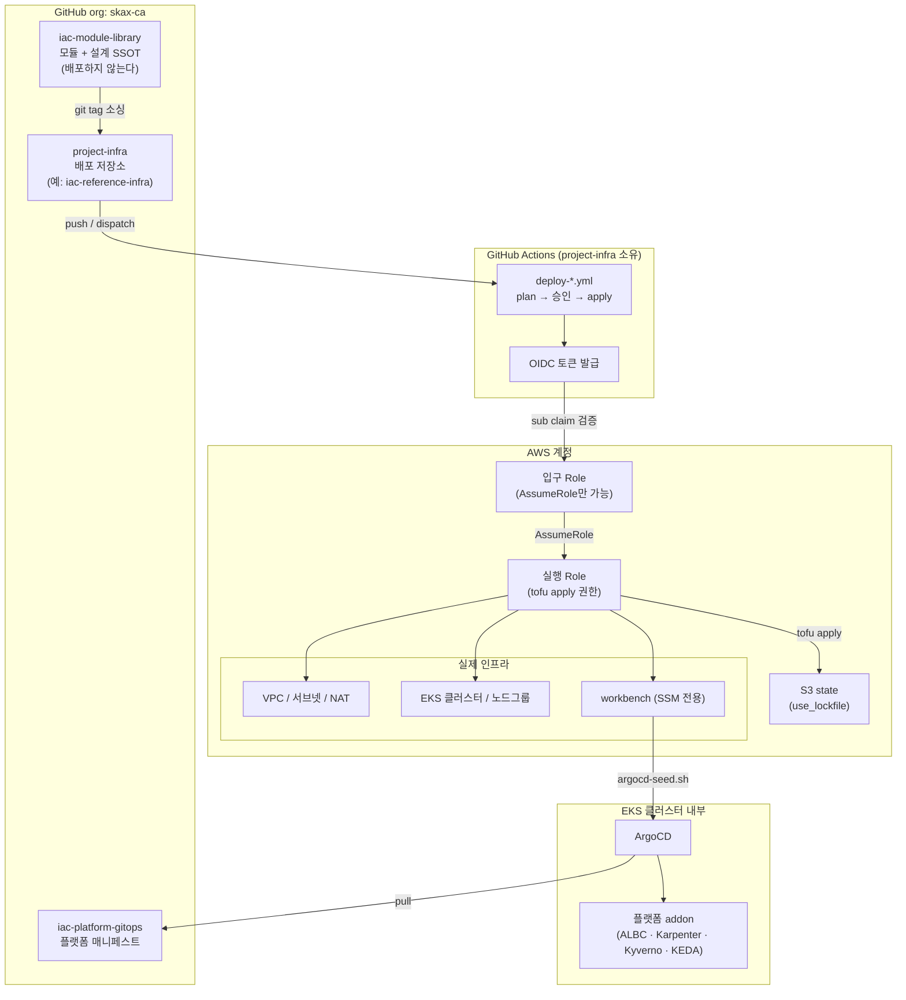

# 01. 아키텍처 — 전체 그림

**읽는 사람**: 팀에 처음 온 사람. 이 자산이 무엇을 만드는지, 무엇을 만들지 않는지 알고 싶은 사람.

---

## 1. 무엇을 만드는가

고객사 계정에 **EKS 기반 플랫폼**을 세우고 GitOps로 운영하는 데 필요한 것 전부다.

```
AWS 계정
  |
  +-- VPC · 서브넷 · NAT · Flow Logs            <- modules/vpc
  |
  +-- EKS 클러스터 · 노드그룹 · addon · IAM      <- modules/eks-cluster
  |
  +-- workbench (운영 지점, SSM 전용)            <- modules/workbench
  |
  +-- ArgoCD                                    <- scripts/argocd-seed.sh
        |
        +-- 플랫폼 addon (ALBC · Karpenter · Kyverno · KEDA ...)
              <- iac-platform-gitops 저장소를 pull
```

EKS 엔드포인트는 **private**이다. 그래서 클러스터에 명령을 넣을 지점이 계정 안에 필요하고,
그것이 `workbench`다. 노트북에서 `kubectl`이 직접 닿지 않는다.

---

## 2. 3계층 소유 모델

GitOps를 "인프라 대 앱" 한 덩어리로 다루지 않는다. **소유자·변경주기·영향범위가 다른 3계층**으로
가르되, **ArgoCD 허브는 하나로 공유**한다.

| 계층 | 무엇 | 소유자 | 어디에 | 도구 | 범위 |
|------|------|--------|--------|------|:---:|
| **1. 인프라** | 클러스터 · baseline addon · IAM · Access Entry | 플랫폼팀 | `<project>-infra` | OpenTofu | ✅ |
| **2. 플랫폼 GitOps** | helm addon · Karpenter NodePool · 클러스터 등록 · AppProject | 플랫폼팀 | `iac-platform-gitops` | ArgoCD | ✅ |
| **3. 앱 GitOps** | 비즈니스 워크로드 | **각 앱팀** | 앱팀별 저장소 N개 | ArgoCD | ❌ |

**왜 가르는가**: 플랫폼 addon 업그레이드는 전 클러스터에 영향을 주고, 앱 배포는 한 팀에만 영향을 준다.
다른 저장소 · 다른 리뷰어 · 다른 릴리스 주기여야 **실수 하나가 fleet 전체를 흔들지 않는다**.

**계층 3은 이 자산의 범위 밖이다.** 앱팀이 실제로 생기면 그때 각 팀 저장소로 떼어낸다.
그 분리를 안전하게 만드는 장치가 계층 2가 소유하는 **AppProject**다 —
`sourceRepos`와 `destinations`가 *"각 앱팀은 자기 저장소에서 자기 네임스페이스로만"* 을 강제한다.

---

## 3. 계층 1과 2의 경계 — 컨트롤러와 설정을 가른다

| 무엇 | 어느 계층 | 예 |
|------|----------|-----|
| **컨트롤러 자체** | 계층 1 (OpenTofu) | EKS managed addon 6종 |
| **컨트롤러가 소비하는 설정 CR** | 계층 2 (GitOps) | Karpenter NodePool · Kyverno ClusterPolicy |

이 경계가 중요한 이유: 컨트롤러는 **클러스터 생성 시점**에 있어야 하고(닭과 달걀 문제),
설정은 **운영 중 자주 바뀐다**. 변경 주기가 다르면 소유 도구도 달라야 한다.

---

## 4. 그 CR은 계층 2인가 3인가 — 판별 두 가지

*"cluster-scoped면 플랫폼, namespace-scoped면 앱"* 은 **성립하지 않는다**. 반례가 실재한다.
스코프가 아니라 아래 두 질문이 정한다.

**판별 1 — 인프라 정체성을 담는가?**
IAM role · 비용 · 용량 · 발급 신뢰를 인코딩하면 **계층 2**다. 스코프와 무관하다.

**판별 2 — 누군가를 제약하는 규칙인가?**
가드레일은 **제약받는 쪽이 소유하면 무의미**하다. 앱팀을 제약하는 정책은 **계층 2**다.

| CR | 스코프 | 계층 | 판별 |
|---|---|---|---|
| Karpenter NodePool · EC2NodeClass | cluster | 2 | 1 — `spec.role`이 IAM을 인코딩 |
| Kyverno ClusterPolicy | cluster | 2 | 2 — 앱팀을 제약하는 가드레일 |
| cert-manager Issuer | **namespace** | **2** | 1 — 발급 신뢰는 인프라다 |
| KEDA ScaledObject | namespace | 3 | 특정 워크로드에 결합 |
| KEDA ClusterTriggerAuthentication | **cluster** | **2** | 앱 인증에 결합하나 공유 제공물 |

굵게 표시한 두 행이 *"스코프로 판정하면 틀린다"* 의 증거다.

---

## 5. 세 저장소가 계층을 어떻게 나눠 갖는가

```
iac-module-library         모듈(.tf) + 설계 문서.        어느 계층도 "실행"하지 않는다
        |                  배포하지 않는다
        |  git tag
        v
<project>-infra            계층 1을 실행한다.            state는 S3, 실행은 GitHub Actions
        |                  (iac-reference-infra가 레퍼런스)
        |  EKS + ArgoCD seed
        v
iac-platform-gitops        계층 2의 매니페스트.          ArgoCD가 pull로 reconcile
                           .tf가 없다
```

**이 저장소는 배포하지 않는다.** 그래서 여기서 "동작한다"의 기준은
`tofu test` + 예제 `validate`까지이고, `apply` 판정은 배포 루트의 몫이다.

`.yaml` 매니페스트를 이 저장소에 두지 않는다. ArgoCD Application · AppProject · cluster Secret은
전부 `iac-platform-gitops` 소관이다.

---

## 6. 실행 기반

배포 루트가 담당한다. 이 저장소는 규약만 소유한다.

| 항목 | 규칙 |
|------|------|
| plan → apply | plan을 artifact로 저장해 승인 후 **그 파일을** apply한다 |
| 승인 게이트 | Environment protection rules. prd는 항상 수동 승인 |
| 동시 실행 | `concurrency: {cancel-in-progress: false}` — apply 중단은 state 잠금을 남긴다 |
| 자격증명 | GitHub OIDC → 입구 Role → 실행 Role. 정적 키를 만들지 않는다 |
| state | S3 + `use_lockfile = true` (DynamoDB 불필요) |

---

## 7. 전체 흐름 — GitHub에서 AWS까지 한눈에

위 「무엇을 만드는가」·「세 저장소가 계층을 어떻게 나눠 갖는가」·「실행 기반」과
[`00-team-access.md`](00-team-access.md)에 나눠 있는 조각을 한 그림으로 합친 것이다.
세부 규칙은 각 절이 소유하고, 이 다이어그램은 **순서와 관계**만 보여준다.



- **이 저장소(`iac-module-library`)는 이 그림 어디에도 실행 주체로 등장하지 않는다** — 소싱만 되고, CI·AWS 계정·클러스터는 전부 `project-infra`(계층 1)와 `iac-platform-gitops`(계층 2) 몫이다.
- 인증 체인 상세 → [`00-team-access.md`](00-team-access.md)
- 부트스트랩·워크플로 명령 실물 → [`03-hub-lifecycle.md`](03-hub-lifecycle.md)

---

## 다음

- 새 프로젝트를 시작한다 → [`02-choose-your-path.md`](02-choose-your-path.md)
- 모듈의 입출력 계약 → [`05-modules.md`](05-modules.md)
- 왜 이런 선택을 했나 → [`08-decisions.md`](08-decisions.md)
