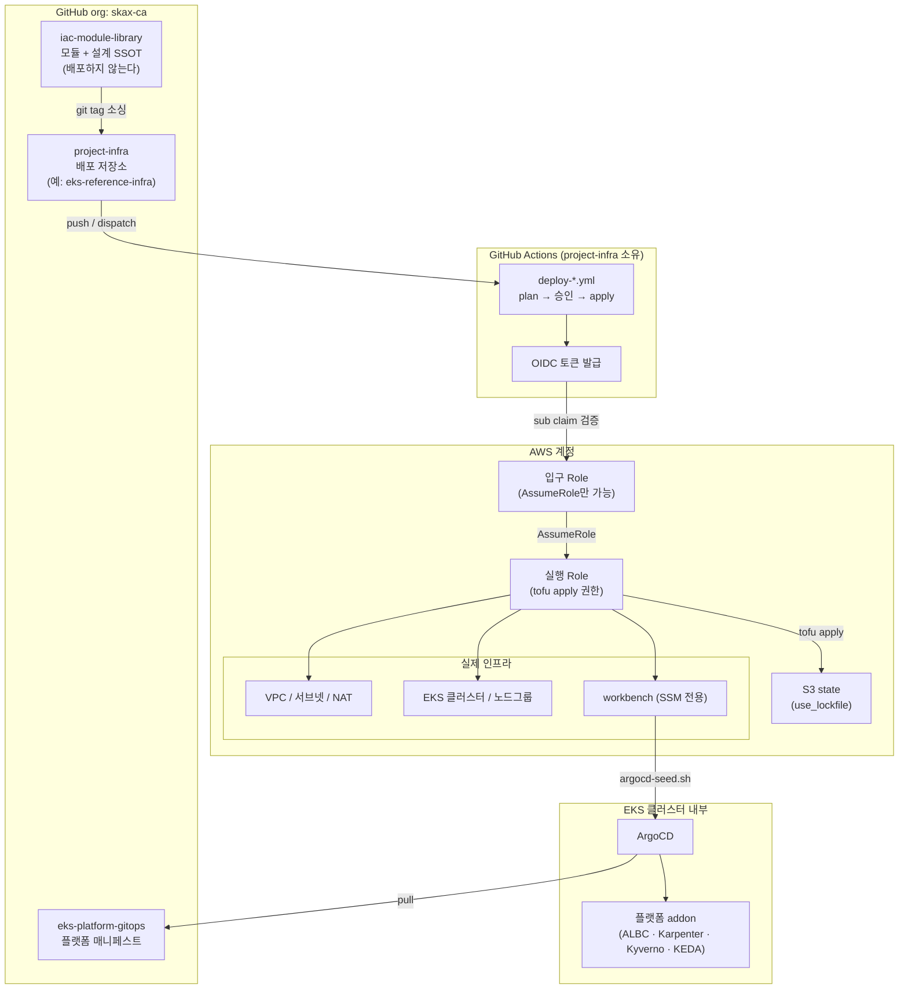

# AWS(EKS)에서 이 패턴

**읽는 사람**: AWS에서 이 패턴을 세우려는 사람.

패턴 자체(3계층·저장소 구성·이 패턴이 맞는 환경)는 [../README.md](../README.md)가, 계층 2
운영은 [../gitops.md](../gitops.md)가, 허브 위치와 크로스 계정 네트워크는
[network.md](network.md)가 소유한다.

---

## 1. 구성

고객사 계정에 EKS 기반 플랫폼을 세우고 GitOps로 운영하는 데 필요한 것 전부다.

```
AWS 계정
  |
  +-- VPC · 서브넷 · NAT · Flow Logs            <- modules/aws/vpc
  |
  +-- EKS 클러스터 · 노드그룹 · addon · IAM      <- modules/aws/eks-cluster
  |
  +-- workbench (운영 지점, SSM 전용)            <- modules/aws/workbench
  |
  +-- ArgoCD                                    <- argocd-seed.sh (eks-platform-gitops)
        |
        +-- 플랫폼 addon (ALBC=AWS Load Balancer Controller · Karpenter · Kyverno · KEDA ...)
              <- eks-platform-gitops 저장소를 pull
```

EKS 엔드포인트는 **private**이다. 그래서 클러스터에 명령을 넣을 지점이 계정 안에 필요하고,
그것이 `workbench`다. 노트북에서 `kubectl`이 직접 닿지 않는다.

`eks-reference-infra`가 이 패턴을 세우는 레퍼런스 배포 저장소다. 클러스터 안에 ArgoCD를
설치하는 부트스트랩 스크립트 `argocd-seed.sh`는 `eks-platform-gitops`의 `bootstrap/`이
소유한다. workbench가 그 저장소만 클론하기 때문이다.

---

## 2. 어느 ArgoCD인가: 관리형 / self-managed

**기본은 관리형**(EKS Capability for Argo CD)이다. 아래 **탈출 조건 하나라도** 걸리면 self-managed다.

| # | 탈출 조건 | 확인 방법 |
|---|----------|----------|
| 1 | **IAM Identity Center 미보유·도입 불가** | 관리형은 IdC가 **유일 인증 경로**다. 우회로가 없다 |
| 2 | 미지원 기능 중 **필수인 것**이 있다 | 아래 목록과 대조한다 |
| 3 | **Application 수 기준 과금**이 수용 불가 | 예상 Application 수 x 단가를 **계산해서** 판정한다 |

**탈출 조건은 위 세 가지 사실뿐이다.** 셋 다 아니면 관리형이다.
*"직접 운영하는 게 편하다"* 는 조건이 아니다.

### 관리형 미지원 기능 (탈출 조건 2의 판정 근거)

Config Management Plugins · custom Lua health check · **Notifications controller** ·
**custom SSO**(IdC 전용) · UI extensions · `argocd-cm`/`argocd-params` 직접 접근 ·
sync timeout 120초 고정 · Application/ApplicationSet/AppProject는 **단일 네임스페이스 강제** ·
IdC identity 1,000개 한도.

CLI 제약도 함께 본다: `argocd login` 미지원(토큰만) · `argocd admin` 미지원 ·
`--grpc-web` 필수 · 앱 지정에 네임스페이스 접두 필요.

### 두 경로가 갈리는 축 여섯 개

| # | 갈림점 | 관리형 Capability | self-managed helm |
|---|--------|------------------|-------------------|
| 1 | **부트스트랩** | `awscc_eks_capability`: **IaC 산출물** | `helm install`: workbench에서 실행하는 **절차** |
| 2 | **인증·RBAC** | IdC 강제. `rbac_role_mappings` | 자유(local / OIDC). `argocd-rbac-cm` 사용 |
| 3 | **cluster 등록** | Secret `server` = 클러스터 ARN. local도 **명시 등록 필요** | `https://kubernetes.default.svc`. 연결은 자동이나 **Secret은 여전히 만든다** |
| 4 | **namespace** | 단일 강제 + immutable | 자유 |
| 5 | **기능 표면** | 위 미지원 목록 | upstream 전체 |
| 6 | **저장소 접근** | **CodeConnections** 프록시 URL. 자격증명 없음 | GitHub 직접. GitOps 저장소가 **public**이라 repository Secret 없이 익명으로 읽는다. private이면 GitHub App private key가 seed 예외로 생긴다 |

> 1과 3은 같은 뿌리다: **ArgoCD가 클러스터 안에 있는가.**
> self-managed는 내부 워크로드라 자기 apiserver에 ServiceAccount로 닿는다.
> 관리형은 클러스터 밖이라 Access Entry와 명시 등록이 둘 다 필요하다.

### 운영 특성이 갈리는 축 셋

| 축 | 관리형 | self-managed |
|---|---|---|
| **비용** | Application 수에 선형 | 기존 노드를 쓰면 한계비용 거의 0 |
| **업그레이드·HA·패치** | **AWS 소유** | **우리 소유**: 여기가 전담 인력을 요구한다 |
| **private 도달성** | AWS 소유 (peering 불필요) | 우리 설계: workbench 경유 port-forward |

> 관리형은 `.tf` 리소스이고 self-managed는 helm 실행 절차다. 두 경로의 문서 분량이 대칭이
> 아닌 것이 정상이다. **self-managed ArgoCD는 이 저장소의 모듈이 아니다.**

### 단가 확인

가격은 문서에 적지 않는다. 리전·시점에 따라 달라지므로 **결정 시점에 조회한다**.

```bash
aws pricing get-products --region us-east-1 \
  --service-code AmazonEKS --filters 'Type=TERM_MATCH,Field=regionCode,Value=ap-northeast-2'
```

---

## 3. addon을 어디에 두나: EKS의 분류

계층 판정 원칙은 [../gitops.md](../gitops.md)가 소유한다. EKS에서 그 원칙을 적용한 분류다.

| 분류 | 어디 | 예 |
|------|------|-----|
| **EKS managed addon** | 계층 1 (OpenTofu) | vpc-cni · coredns · kube-proxy · pod-identity-agent |
| **helm addon** | 계층 2 (GitOps) | ALBC · Karpenter · Cluster Autoscaler · Kyverno · KEDA |
| **설정 CR** | 계층 2 (GitOps) | NodePool · ClusterPolicy |

> **Karpenter와 Cluster Autoscaler는 동시에 켤 수 있다**: `eks-cluster` 모듈의
> `enable_karpenter`·`enable_cluster_autoscaler`는 상호 배제하지 않는다(서로 다른 리소스를
> 다룬다: Karpenter=EC2 직접 프로비저닝, CA=`managed_node_groups`의 ASG). 단, 워크로드를
> taint로 분리하지 않으면 같은 pending pod에 두 컨트롤러가 동시에 반응해 중복 프로비저닝이
> 일어날 수 있다(근거: karpenter.sh FAQ · `aws/karpenter-provider-aws#2543`). 검증된 taint
> 분리 패턴은 `eks-reference-infra`의 운영 문서를 참조한다.

### 네임스페이스 예외

전용 네임스페이스가 원칙이고([../gitops.md](../gitops.md)), EKS에서 인정한 예외는 셋이다.

| addon | 네임스페이스 | 이유 |
|-------|-------------|------|
| **Karpenter** | `kube-system` | APF FlowSchema(`kube-apiserver`의 API Priority and Fairness 요청 분류 규칙)가 이 네임스페이스를 전제한다 |
| **AWS Load Balancer Controller** | `kube-system` | 공식 문서 + Pod Identity association |
| **Cluster Autoscaler** | `kube-system` | ⚠️ **관례다. 원칙이 요구하는 근거가 없다**. 알면서 택했다(공식 요구사항도 official 문서 근거도 없음) |

> 예외를 늘리려면 **위 두 근거(Karpenter·ALBC)에 준하는 것**을 대야 한다.
> **Cluster Autoscaler는 이 바를 통과하지 못한 채로 예외에 들어갔다.** 근거가 약한 것을 알고
> 관례를 택했다. 더 강한 근거 없이 이 전례를 들어 새 예외를 늘리지 않는다.

---

## 4. 되돌릴 수 없는 선택 (AWS)

공통 항목은 [../README.md](../README.md)가 갖는다.

| 선택 | 되돌릴 수 있나 | 바꾸려면 |
|------|:---:|---------|
| VPC CIDR | ❌ | VPC 재생성 = 전면 재구축 |
| EKS `authentication_mode` | ❌ | 되돌리는 방향의 전환이 막혀 있다 |
| 관리형 ArgoCD의 namespace | ❌ | `createOnly`: immutable |
| 관리형 <-> self-managed 전환 | ⏳ | 가능하나 재설치 + 재등록. 무중단이 아니다 |
| 허브 같은 계정 <-> 분리 | ⏳ | 스포크마다 크로스 계정 신뢰 Role·Access Entry를 새로 만들어야 한다([network.md](network.md)) |

---

## 5. 실행 기반

공통 규칙(plan artifact · 승인 게이트 · 동시 실행)은 [../README.md](../README.md)에 있다.
AWS에서만 정해지는 것은 둘이다.

| 항목 | 규칙 |
|------|------|
| 자격증명 | GitHub OIDC → 입구 Role → 실행 Role(2단 체인). 정적 키 금지. 실행 Role은 **입구 Role만** 신뢰한다(계정 루트를 신뢰하면 그 계정의 아무 주체나 체인을 탈 수 있다) |
| state | S3 + `use_lockfile = true` (DynamoDB 불필요) |



**이 저장소는 이 그림 어디에도 실행 주체로 등장하지 않는다.** 소싱만 되고, CI·AWS 계정·클러스터는
전부 계층 1·2 저장소 몫이다. 부트스트랩·워크플로 명령 실물은 `eks-reference-infra`에 있다.

---

## 6. spoke 등록 해제: CR을 그 컨트롤러보다 먼저 prune한다

spoke의 addon은 hub ArgoCD가 ApplicationSet으로 뿌린다. cluster Secret에서 매칭 라벨을 빼면
ApplicationSet마다 자기 Application을 **따로** 지우고, Argo CD는 Application 사이의 삭제 순서를
보장하지 않는다. cascade delete가 기다리는 것은 한 Application 안의 리소스뿐이다. 그래서 finalizer를
**다른 Application의 컨트롤러**가 처리하는 CR은, 컨트롤러가 먼저 사라지면 `deletionTimestamp`를 낀 채
멈추고 AWS 쪽 뒷정리도 끝나지 않는다.

| CR을 가진 ApplicationSet | finalizer를 처리하는 컨트롤러 | 컨트롤러가 먼저 사라지면 |
|---|---|---|
| `gateway` (Gateway · GatewayClass · LoadBalancerConfiguration) | ALBC | ALB는 회수되지만 frontend·backend SG 2개가 고아로 남아 VPC destroy를 막는다 |
| `karpenter-nodepool` (NodePool · EC2NodeClass) | Karpenter | `EC2NodeClass`가 멈추고, 떠 있던 Karpenter 노드가 회수되지 않을 수 있다 |

그래서 해제를 **2단계**로 나눈다. cluster Secret에 `decommission` 라벨을 붙이면 위 두 ApplicationSet만
그 클러스터를 놓는다(selector에 `decommission` `DoesNotExist`). 컨트롤러가 살아 있는 동안 CR이
지워지므로 finalizer가 정상 처리된다. 두 Application이 hub에서 사라지고 이 클러스터 태그의 SG가
0개인 것을 확인한 뒤 매칭 라벨을 빼 나머지를 지운다. 라벨 계약은 `eks-platform-gitops`의
`README.md`가, 명령 순서는 `eks-reference-infra`의 `spoke-lifecycle.md`가 갖는다.

- ⚠️ 1단계에서 NodePool이 지워지면 Karpenter 노드의 파드가 쫓겨난다. ALBC·Kyverno·Karpenter는 시스템
  노드그룹의 `CriticalAddonsOnly` taint를 넘는 toleration이 있어 시스템 노드로 옮겨 계속 돈다. 이
  toleration 없이 Karpenter 노드에만 뜨는 컨트롤러가 생기면 1단계 목록을 다시 본다.
- CR을 소유하는 addon을 새로 넣을 때: 그 CR의 finalizer를 다른 Application의 컨트롤러가 처리하면 그
  ApplicationSet selector에도 같은 조건을 넣는다.
- `DoesNotExist` 조건 추가는 `decommission` 라벨이 없는 클러스터의 매칭 결과를 바꾸지 않는다.
  selector를 배포된 계약으로 보는 규칙([`gitops.md`](../gitops.md)의 「하지 않는 것」)에 걸리지 않는다.
- ⏳ 다음 spoke 철거에서 SG 고아 0과 `EC2NodeClass` 정상 소멸을 실측한다.

---

## 7. 하지 않는 것

| 하지 말 것 | 이유 |
|---|---|
| **EKS Auto Mode** 채택 | 「관리형 기능 채택 기준」([`decisions.md`](../../../decisions.md))의 기준(패턴 충돌)에 걸린다. Auto Mode 내장 로드밸런서 컨트롤러가 Gateway API를 지원하지 않고(이 패턴이 Gateway API로 받는 이유는 [`gitops.md`](../gitops.md)의 「L7 진입: Gateway API」), self-managed ALBC가 만든 로드밸런서를 Auto Mode 관리로 옮기는 경로도 AWS가 지원하지 않는다. Auto Mode 노드에는 VPC CNI의 `ENIConfig` custom networking을 쓸 수 없어 `eks-cluster`의 Pod 비라우팅 대역 배선을 NodeClass로 다시 설계해야 한다. EC2 요금에 더해 인스턴스 유형별 관리 수수료도 붙지만, 기각은 이 두 충돌로 정했다. 재평가 트리거: Auto Mode 로드밸런서 컨트롤러가 Gateway API를 지원하게 되면 |
| 매니페스트에 **AWS가 발급한 ID**(VPC ID · 해시 붙은 role 이름) 적기 | 환경을 다시 세우면 값이 바뀌어 없는 자원을 가리킨다. 계층 1이 **이름을 결정적으로** 만들고 계층 2는 이름을 참조한다 |
| ALBC를 위해 노드 **IMDS hop limit을 2로** | 그 노드의 모든 파드가 노드 IAM role을 탈취할 수 있다. VPC는 `--aws-vpc-tags`로 찾는다 |
| **eksctl** 도입 | IaC 소유 경계를 깬다 |
| 비밀번호를 **`ssm send-command`** 로 조회 | 출력이 SSM에 저장되고 CloudTrail에 남는다. 대화형 세션에서만 읽는다 |
| spoke 해제 직전에 **`kubectl delete gateway`로 순서를 끼워 넣기** | 매칭 라벨을 빼기 전에는 gateway Application의 `selfHeal`이 수 초 안에 되살리고, 뺀 뒤에는 ALBC Application이 이미 prune됐을 수 있다 |
| spoke 해제 순서를 **Progressive Syncs `deletionOrder: Reverse`** 로 맞추기 | 순서는 한 ApplicationSet이 만든 Application 사이에만 걸린다. 쓰려면 baseline ApplicationSet을 하나로 합쳐야 하고, RollingSync는 생성되는 Application의 autosync를 강제로 끈다. v3.3 기준 베타다 |
| ALBC SG 고아를 **SG 직접 공급**(`LoadBalancerConfiguration.securityGroups` · 차트 `backendSecurityGroup`)으로 없애기 | SG 고아는 막지만 Gateway CR의 finalizer 멈춤은 남는다. 2단계 해제가 둘 다 막으므로 SG를 계층 1로 옮기는 모듈·배포 루트 변경을 낼 이유가 없다. 재평가 트리거: 2단계 해제로도 SG 고아가 재현되면 |
