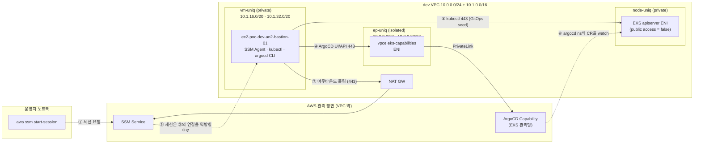

# 40 · Bastion (SSM 기반 관리 호스트) 설계

> **승계(미개정)**: `terraform-enterprise-poc` `docs/design/40-bastion.md` @ `76285f7`(동결 커밋)
>
> ⚠️ **이 문서는 아직 정밀 개정되지 않았다.** PoC 전제(Terraform 1.15 + HCP Terraform,
> `workload=poc`, 상대경로 모듈 소싱, TFC 워크스페이스)와 **실증 서술이 그대로 남아 있다.**
>
> - 본문의 실증 날짜·run ID·"실증됨" 서술은 **이 repo에서 재현된 것이 아니다** —
>   정리본은 [`../reference/poc-findings.md`](../reference/poc-findings.md)를 본다.
> - 설계 판단(리소스 구성·경계·트레이드오프)은 대체로 유효하나, **실행 스택 종속부는 무효**다.
>
> **모듈 이식 시점(D-OSS-STACK §6-2)에 재검토하며 개정한다.** 그 전까지 이 문서를
> "이 repo의 확정 설계"로 인용하지 않는다.


> 2026-07-23 신설. **ArgoCD private 전환의 선결 과제**를 해소한다.
> 2026-07-24 개정: private 전환 완료(§7 40.6) 후 bastion의 역할이 확장됐다 — 진단 도구를 넘어
> **GitOps seed 수행 지점**으로 확정(§6 · 20 §2.8 D-SEED-KUBECTL). §9 열린 항목 4는 종결.
> 같은 날 **UI 접근 경로도 확정**(§9-3 채택, V-9 통과) — SSM 포트포워딩, 단 **로컬 포트 443 강제**
> (envoy `:authority` 라우팅으로 8443은 404. §6 함정 블록에 실증 기록).
> [`20-eks-module.md §2.7`](20-eks-module.md)의 노출 토글(`argocd_endpoint_access`)을 `private`으로
> 넘기려면 VPC 내부에 조작 지점이 있어야 한다 — 이 문서가 그 조작 지점을 정의한다.
> 상위 규약은 [`../architecture/02-naming-tagging-and-pinning.md`](../architecture/02-naming-tagging-and-pinning.md)(네이밍·태깅)와
> [`../architecture/03-dependencies.md`](../architecture/03-dependencies.md)(의존성·공유 리소스)를 전제한다.

---

## 0. 배경 — 왜 지금 필요한가

ArgoCD Capability는 AWS 관리 평면이라 VPC 자원이 아니지만, `private` 모드는 그 서비스를
**Interface VPC Endpoint(PrivateLink)로 VPC 안 ENI에 투영**한다. 즉 `private` 전환 후의 도달성은
세 조건의 AND다.

1. ENI의 private IP로 TCP 443 라우팅이 성립할 것
2. `serverUrl` 호스트명이 그 private IP로 **DNS 해석**될 것 (VPC resolver 경유)
3. VPCE의 SG가 소스를 허용할 것

**2026-07-23 실측 — 현재 이 조건을 만족하는 조작 지점이 없다.**

| 항목 | 실측값 | 함의 |
|------|--------|------|
| dev VPC(`vpc-0c8371732d66e081e`) VPC Endpoint | **0개** | public 모드라 정상 — 전환 시 생성됨 |
| NAT Gateway | `nat-066f4eaa9428a9caf` available | private 서브넷 아웃바운드 성립 |
| EKS 노드 | `10.1.7.146` · `10.1.6.114` (node-uniq) | 네트워크는 VPC 내부 |
| **노드 SSM 상태** | **`ConnectionLost`** | 노드 인스턴스 프로파일에 SSM 정책 없음 → **접속 불가** |
| bastion | **없음** | — |

→ 지금 `private`으로 전환하면 **UI도 CLI도 접근 수단이 사라진다.** 그래서 전환보다 bastion이 먼저다.

---

## 1. 결정 요약

| ID | 결정 | 근거 |
|----|------|------|
| **D-BASTION-OWNER** | 새 컴포넌트 `live/dev/bastion` (TFC workspace `bastion-dev`) | bastion은 수시 생성·파기되는 운영 자원이고 VPC는 기반 계층 — 생명주기가 다르다. `networking`에 넣으면 bastion을 만질 때마다 VPC plan이 함께 돌아 기반 계층에 불필요한 위험이 생긴다. `gitops-hub` 편입은 cicd 계정 컴포넌트가 dev 계정 EC2를 소유하게 되어 향후 hub 계정 이관의 걸림돌이 된다(03 §3.1) |
| **D-BASTION-ACCESS** | **SSM Session Manager 전용** — SSH·키페어·공인 IP·인바운드 SG 규칙 전부 없음 | SSM은 Agent가 **아웃바운드로** 연결을 맺고 세션이 그 연결을 역방향으로 흐르는 구조라 인바운드가 원천적으로 불필요. 키 관리·22번 노출·감사 공백이 동시에 사라진다 |
| **D-BASTION-SUBNET** | **`vm-uniq` (private, NAT)** — `snet-poc-dev-an2-vm-uniq-a/c` | D-BASTION-ACCESS의 귀결. 인바운드가 없으므로 public 서브넷은 **이득 없이 공격면만 늘린다.** 10-vpc §1.5 프리셋의 `vm-uniq`가 `private` 타입이라 서브넷 신설 불요 |
| **D-BASTION-EGRESS** | 기존 NAT 경유 (SSM VPCE 3종 미신설) | 추가 비용 0, 구성 단순. SSM 제어 트래픽은 TLS로 보호되며 AWS 권장 구성 중 하나. VPCE 3종×2AZ는 상시 시간당 요금이 붙어 PoC 단계에 과하다 → §9 열린 항목으로 이월 |
| **D-BASTION-LIFECYCLE** | 상시 기동 소형 인스턴스(`t4g.nano`) | 즉시 접속 가능한 운영 편의. 인바운드가 없어 상시 기동의 공격면 증가가 미미하다. 월 $5 미만 |
| **D-BASTION-SGREF** | **VPCE SG 추가 조치 불요** | `gitops-hub`의 VPCE ingress가 이미 **VPC 전 CIDR 대역** 443을 허용한다(`live/cicd/gitops-hub/main.tf:116`, `cidr_block_associations` 순회). bastion이 VPC 안에 있으면 자동 포함 → 컴포넌트 간 SG 참조·순서 의존이 발생하지 않는다 |
| **D-BASTION-K8S** | bastion에서 **kubectl 사용** — Access Entry(`AmazonEKSClusterAdminPolicy`, cluster scope)를 **`live/dev/bastion`이 소유**하고, IAM 인라인 정책으로 `eks:DescribeCluster`를 부여하며, user_data가 kubeconfig를 생성한다 | dev apiserver는 `endpointPublicAccess=false`·`endpointPrivateAccess=true`(2026-07-23 실측)라 **VPC 내부에서만 도달** — bastion이 유일한 조작 지점이다. Access Entry 소유를 bastion에 두는 것은 `gitops-hub`가 스포크 Access Entry를 직접 소유하는 기존 패턴(§2.8 D-SPOKE-SEAM)과 일관되며, bastion 파기 시 접근권도 함께 사라져 잔재물이 남지 않는다. ⚠️ ClusterAdmin이므로 **SSM 접근 통제가 곧 클러스터 보안**이 된다 — §9 열린 항목 1(세션 로깅)의 중요도가 이 결정으로 올라간다 |
| **D-BASTION-AMI-PIN** | AMI ID를 **명시 핀**(`ami-0e9f53ecbca0f42fd`) — `latest` SSM 파라미터 금지 | `latest`는 AWS 릴리스마다 값이 바뀌어 **리뷰 없이 인스턴스가 재생성**된다. D-ADDON-VERSION-PIN(20 §2.6-6)과 동일한 원칙 — 업그레이드 판단을 Terraform이 매 plan마다 대신 내리게 두지 않는다. §3 참조 |
| **D-BASTION-INLINE** | 모듈화하지 않고 `live/dev/bastion`에 인라인 | 리소스 5개 미만·분기 없음. `gitops-hub`의 vpce/SG를 인라인으로 둔 것과 동일 판단(01-strategy 계층형 하이브리드 — 얇은 것은 굳이 감싸지 않는다). stg/prd 확장 시 모듈 승격 |

---

## 2. 네트워크 도달 경로



**핵심**: ①②는 별개 방향이며, bastion으로 들어오는 인바운드 연결은 존재하지 않는다.
④는 `private` 전환 후의 경로이고, 현재 `public` 모드에서는 ④가 NAT를 거쳐 공인 엔드포인트로 나간다.

**④와 ⑤는 목적지도 인증도 다른 별개 경로다** — 혼동하면 진단이 어긋난다:

| | ④ ArgoCD 서버 | ⑤ apiserver |
|---|---|---|
| 목적지 | Capability 엔드포인트(VPC 밖, vpce 경유) | 클러스터 apiserver ENI(VPC 안) |
| 인증 | IdC → UI → **JWT 토큰**(§9-4) | **IAM**(Access Entry) |
| 용도 | UI 관찰·`argocd app sync`류 | **GitOps seed**(§6) · 진단 |
| 접근 제어 | vpce SG 443 | cluster SG ingress 443 |

⑥이 seed가 성립하는 이유다 — 관리형 ArgoCD는 클러스터 밖에서 돌지만 **desired-state는 클러스터
`argocd` 네임스페이스의 CR**을 읽는다. 그래서 ⑤(kubectl)만으로 ④를 거치지 않고 seed할 수 있다.

---

## 3. 리소스 구성

| 리소스 | `Name` 태그 | 비고 |
|--------|-------------|------|
| `aws_instance` | `ec2-poc-dev-an2-bastion-01` | `t4g.nano`(arm64), AL2023 |
| `aws_security_group` | `sgr-poc-dev-an2-bastion` | **ingress 규칙 0개** |
| `aws_vpc_security_group_egress_rule` | — | 443/tcp → `0.0.0.0/0` 1건만 (SSM·패키지·GitHub 전부 HTTPS) |
| `aws_iam_role` | `iamr-poc-dev-an2-bastion` | 관리형은 `AmazonSSMManagedInstanceCore` 1개 + 인라인 정책(아래) |
| `aws_iam_role_policy` (인라인) | `iamr-poc-dev-an2-bastion-eks` | `eks:DescribeCluster` **해당 클러스터 ARN 한정** — `update-kubeconfig`에 필요한 최소 권한(D-BASTION-K8S) |
| `aws_eks_access_entry` | — | principal = bastion role, `STANDARD` |
| `aws_eks_access_policy_association` | — | `AmazonEKSClusterAdminPolicy`, scope = `cluster` |
| `aws_vpc_security_group_ingress_rule` (EKS cluster SG 대상) | — | apiserver 443 ← bastion SG. **EKS 접근의 세 번째 층**(아래) |

> **EKS 접근은 세 층이 모두 성립해야 한다 (2026-07-23 V-8 실증)**
>
> | 층 | 무엇을 결정하나 | 없으면 나타나는 증상 |
> |----|----------------|---------------------|
> | IAM `eks:DescribeCluster` | kubeconfig를 만들 수 있는가 | `update-kubeconfig` 권한 오류 |
> | Access Entry + 정책 | 클러스터 **안에서** 무엇을 하는가 | `401 Unauthorized` |
> | **SG ingress 443** | apiserver에 **네트워크로 닿는가** | **`dial tcp …: i/o timeout`** |
>
> 초회 구현에서 앞의 두 층만 갖춰 V-8이 timeout으로 실패했다. 인증 오류가 아니라 **타임아웃**이었다는
> 것이 단서 — 인증 계층에 닿지도 못했다는 뜻이다. apiserver ENI에는 EKS가 자동 생성한
> cluster SG(`sg-0cc911a9…`)가 붙고 기본 규칙은 노드 통신만 허용한다.
| `aws_iam_instance_profile` | `iamr-poc-dev-an2-bastion` (동일명) | 인스턴스 프로파일 약어가 카탈로그에 **없다** — 임의 생성 금지 규칙(CLAUDE.md)에 따라 새 약어를 만들지 않고 role과 동일 이름을 쓴다. IAM에서 role과 instance profile은 별개 네임스페이스라 충돌하지 않는다 |
| root EBS 볼륨 | `vol-poc-dev-an2-bastion-01` | gp3 10GB, **암호화 필수** |

### AMI 선택 — **명시 핀** (D-BASTION-AMI-PIN)

`data.aws_ssm_parameter`의 `…/al2023-ami-latest/…` 경로는 **사용하지 않는다.** AMI ID를 변수
기본값으로 **고정**한다.

| 항목 | 값 (2026-07-23 실측) |
|------|----------------------|
| AMI ID | **`ami-0e9f53ecbca0f42fd`** |
| AMI 이름 | `al2023-ami-2023.12.20260720.0-kernel-6.1-arm64` |
| 리전 | `ap-northeast-2` (**리전 종속** — 다른 리전 확장 시 재조회 필요) |

**근거**: `latest` 파라미터는 AWS가 새 AMI를 릴리스할 때마다 값이 바뀌어 **리뷰 없이 인스턴스가
재생성**된다. 이는 addon 버전 핀에서 이미 겪은 문제와 동일한 구조다 — `most_recent = true`가
업그레이드 판단을 매 plan마다 Terraform이 대신 내리던 것을 명시 핀으로 되돌린 결정
([`20-eks-module.md §2.6-6`](20-eks-module.md) D-ADDON-VERSION-PIN). AMI도 같은 원칙을 적용한다.

**업그레이드 절차**: `ami_id` 기본값을 bump하는 **명시적 커밋**으로만 갱신한다. plan diff에서
인스턴스 재생성이 보이고, 그것이 의도된 것임을 리뷰에서 확인한 뒤 apply한다.

AL2023은 SSM Agent가 기본 탑재라 별도 설치 과정이 없다.

### 보안 하드닝 (구현 시 필수)
- `metadata_options`: `http_tokens = "required"` (**IMDSv2 강제**), `http_put_response_hop_limit = 1`
- `root_block_device`: `encrypted = true`, `volume_type = "gp3"`
- SSH 키페어 미지정 (`key_name` 없음)
- `associate_public_ip_address` 미지정 (서브넷이 `MapPublicIpOnLaunch=false`)

### user_data
`argocd` CLI와 `kubectl`의 **arm64** 바이너리를 설치한다. 버전은 **명시 핀**(CLAUDE.md 버전 핀 철학) —
`argocd`는 서버 버전 `v3.3.10+eks-4`에 맞춰 `v3.3.10`, `kubectl`은 `stable-1.35.txt` 실측값 `v1.35.7`.

> **⚠️ tmpfs 고갈 실증(2026-07-23) — 다운로드 경로는 반드시 `/var/tmp`**
>
> 초회 배포에서 argocd는 설치되고 **kubectl만 실패**했다. 처음에는 부팅 시점 네트워크 경합으로
> 오진해 `--retry-all-errors`를 넣었으나, **재생성 후에도 동일하게 실패**했다. 실제 원인은 네트워크가
> 아니라 **디스크**다:
>
> ```
> tmpfs  210M  210M  0  100%  /tmp     ← t4g.nano RAM 512MB → tmpfs가 210MB
> /tmp/argocd  197M                     ← argocd 바이너리 하나가 거의 다 점유
> /tmp/kubectl  13M                     ← 여기서 공간 소진 → curl (23) write 실패
> ```
>
> 증상이 `curl: (23) Failure writing output to destination`였고, URL은 전부 `HTTP 200`이었다.
> "나중에 하면 된다"가 아니라 **argocd가 먼저 받아져 공간을 먹는 순서 의존**이라 수동 재시도도 실패한다.
>
> 대책: 다운로드를 **`/var/tmp`(루트 EBS, 8GB 여유)** 로 하고 `install` 직후 원본을 삭제한다.
> `--retry-all-errors`는 이 문제의 해법은 아니지만 부팅 초기 일시적 네트워크 실패를 흡수하므로 유지한다
> (`curl --retry`는 연결 실패만 재시도하고 DNS 실패·HTTP 오류는 재시도하지 않는다).

---

## 4. 인터페이스 (`live/dev/bastion`)

| 변수 | 기본값 | 설명 |
|------|--------|------|
| `workload` / `env` / `region_code` | `poc` / `dev` / `an2` | 네이밍 3요소 |
| `ami_id` | `ami-0e9f53ecbca0f42fd` | **명시 핀**(D-BASTION-AMI-PIN). bump는 별도 커밋 — 인스턴스 재생성을 수반 |
| `instance_type` | `t4g.nano` | arm64 계열 유지 시에만 변경 (`ami_id`가 arm64) |
| `argocd_cli_version` | `v3.3.10` | ArgoCD Capability 서버 버전과 정합 |
| `kubectl_version` | `v1.35.7` | `stable-1.35.txt` 실측값 — EKS 1.35와 정합 |
| `eks_cluster_name` | `eks-poc-dev-an2-main-01` | kubeconfig 대상. 네이밍 규약으로 합성하되 override 가능(D-BASTION-K8S) |
| `bastion_enabled` | `true` | 파기 시 `false` — D-BASTION-LIFECYCLE은 상시지만 토글은 남긴다 |

| 출력 | 설명 |
|------|------|
| `bastion_instance_id` | `aws ssm start-session --target <id>` 에 그대로 사용 |
| `bastion_private_ip` | 도달성 진단용 |

의존 조회는 **네이밍 → data source**(04 §조회 1순위) — `gitops-hub`와 동일 패턴으로
`vpc-poc-dev-an2-main` · `snet-poc-dev-an2-vm-uniq-*`를 조회한다. `tfe_outputs`·remote state sharing
추가 없음 → networking의 output 계약을 넓히지 않는다.

---

## 5. 검증 계획

| ID | 검증 | 통과 기준 |
|----|------|-----------|
| **V-1** | SSM 등록 | `describe-instance-information`에서 `PingStatus: Online` — **✅ 2026-07-23 통과** (Agent 3.3.4624.0) |
| **V-2** | 세션 접속 | `aws ssm start-session --target <id>` 로 셸 진입 — **✅ 통과** (`send-command` Status: Success) |
| **V-3** | (public 상태) ArgoCD 도달 | bastion에서 `curl https://<serverUrl>/api/version` → 200 — **✅ 통과** (`v3.3.10+eks-4`) |
| **V-4** | **private 전환 후 DNS 해석** | bastion에서 `dig <serverUrl>` → **`10.0.0.x` (ep-uniq 대역)** — **✅ 2026-07-24 통과** (`10.0.0.15`·`10.0.0.62`) |
| **V-5** | private 전환 후 CLI 동작 | bastion에서 `curl /api/version` 200 · `argocd version` — **✅ 통과** (`v3.3.10+eks-4`) |
| **V-6** | 음성 대조 | 노트북에서 동일 호출 시 **도달 불가** — **✅ 통과** (`curl EXIT=28`; DNS는 풀리나 사설 IP라 라우팅 불가) |
| **V-7** | kubectl 도구 설치 | `kubectl version --client` 정상 — **✅ 2026-07-23 통과** (`v1.35.7`, `/tmp` 사용률 0%로 tmpfs 고갈 해소) |
| **V-8** | kubectl 클러스터 연결 | `kubectl get nodes` → 노드 응답 — **✅ 통과** (노드 2대 `Ready` `v1.35.6-eks-8f14419`, `get ns`도 정상) |
| **V-9** | **노트북 브라우저에서 ArgoCD UI 도달**(포트포워딩 채택 검증, §9-3) | 포트포워딩 후 노트북에서 `curl https://<serverUrl>/api/version` → 200, **Host 헤더 조작 없이** — **✅ 2026-07-24 통과** (`v3.3.10+eks-4`, root 200, TLS 검증 `ssl_verify_result=0`) |

> **V-8 부수 확인**: `kubectl get pods -n argocd` → `No resources found`. 이는 정상이며 D-ARGOCD가
> 의도한 상태다 — ArgoCD를 클러스터 안에 설치하지 않고 관리형 Capability(클러스터 밖 AWS 서비스)로
> 띄웠으므로 네임스페이스만 있고 파드는 없다. 파드가 나왔다면 오히려 설계와 어긋난 상황이다.

> **V-4 비교 기준선(2026-07-23 확보)**: 현재 `public` 모드에서 bastion의 DNS 해석 결과는
> `3.36.215.115` · `3.39.100.202` · `43.202.187.174` · `3.37.199.83` — **전부 공인 IP**다.
> private 전환 후 이 값이 `10.0.0.x`(ep-uniq 대역)로 바뀌어야 V-4 통과다.
>
> **V-4가 이 설계의 진짜 목표다.** `private_dns_enabled`를 켜지 않고 "AWS가 capability의 serverUrl DNS를
> vpce private IP로 자동 구성한다"는 §2.7 H-2의 결론은 **문서상 근거만 있고 아직 실증되지 않았다.**
> bastion이 그 실증 도구가 된다. V-4가 실패하면 private 전환 자체를 되돌리고 H-2를 재설계해야 한다.

---

## 6. 운영 절차

```bash
# 접속
aws ssm start-session --target <bastion_instance_id> --region ap-northeast-2
```

### ArgoCD UI 접근 — SSM 포트포워딩 (2026-07-24 **채택 확정**, V-9 통과)

private 전환 후 노트북 브라우저로 ArgoCD UI를 보는 유일한 경로다(§9-3 미결 → 채택).

```bash
# ① /etc/hosts 매핑 (한 번만) — TLS 인증서가 호스트명으로 검증되므로 필수
echo "127.0.0.1 <serverUrl 호스트명>" | sudo tee -a /etc/hosts

# ② 터널 — 로컬 포트는 반드시 443 (아래 함정 참조). 443은 특권 포트라 sudo 필요.
sudo AWS_PROFILE=<profile> \
  AWS_CONFIG_FILE=$HOME/.aws/config \
  AWS_SHARED_CREDENTIALS_FILE=$HOME/.aws/credentials \
  aws ssm start-session --target <bastion_instance_id> --region ap-northeast-2 \
  --document-name AWS-StartPortForwardingSessionToRemoteHost \
  --parameters host="<serverUrl 호스트명>",portNumber="443",localPortNumber="443"

# ③ 브라우저 → https://<serverUrl 호스트명>/   (포트 없이)

# ④ 정리 — 터널 Ctrl+C 후
sudo sed -i '' '/eks-capabilities/d' /etc/hosts
```

> **⚠️ 함정: 로컬 포트를 443이 아닌 값으로 두면 404가 난다 (2026-07-24 실증)**
>
> 최초 절차안은 `localPortNumber="8443"`이었으나 **실제로 동작하지 않는다**. 실측:
> `Host: <host>:8443` → **404**(`server: envoy`), `Host: <host>` → **200**.
>
> 관리형 Capability 앞단의 envoy는 **`:authority`(HTTP/2 Host)로 어느 capability인지 라우팅**한다.
> 비표준 포트를 쓰면 Host가 `<host>:8443`이 되어 등록된 라우트와 문자열이 어긋난다. **브라우저는
> 비표준 포트를 항상 Host에 포함**하므로 curl처럼 헤더를 덮어쓸 수 없다 → 로컬 포트는 443 고정.
>
> **진단 교훈(계층 분리)**: TLS는 통과하는데(SNI에는 포트가 붙지 않는다) HTTP에서만 막힌다.
> 그래서 증상이 "연결 실패"가 아니라 "404"였다. 이때 원인을 좁힌 두 증거는
> ① 인증서가 `*.eks-capabilities.<region>.amazonaws.com`으로 검증됨 → 올바른 서비스 앞단까지는 도달
> ② bastion에서 같은 요청이 200 → 엔드포인트는 무죄. 남은 용의자가 Host 헤더뿐이었다.
> §3의 "EKS 접근 세 층"과 같은 소거법이다 — **증상의 계층을 먼저 특정하고 그 계층만 의심한다.**

> **보안 메모**: `/etc/hosts` 항목이 남아 있어도 실질 위험은 없다 — 그 호스트명은 원래
> `10.0.0.x`(VPC 밖 라우팅 불가)로 해석되므로 터널이 없으면 아무 데도 닿지 않는다. 다만 나중에
> "왜 안 되지"로 혼동할 여지를 없애기 위해 세션 종료 시 ④로 제거하는 것을 권장한다.

### GitOps seed 수행 지점 (2026-07-24 추가)

bastion은 진단 도구를 넘어 **ArgoCD 부트스트랩 seed의 수행 지점**으로 확정됐다
(20 §2.8 **D-SEED-KUBECTL** · [`30-gitops-repo.md §4`](30-gitops-repo.md)). 근거는 도달성과 인증 둘 다다:

- **도달성**: dev apiserver는 `endpointPublicAccess=false`라 VPC 내부에서만 닿는다 → bastion이 유일한 조작 지점.
- **인증**: 관리형 Capability의 등록·앱 정의는 hub 클러스터 `argocd` 네임스페이스의 CR이고,
  kubectl 경로는 **IAM(Access Entry)만으로 인증**된다 — ArgoCD 자체 인증 체계(IdC→UI→JWT)를 우회하므로
  **신규 자격증명이 생기지 않는다**. 이것이 argocd CLI 경로 대비 결정적 이점이다(§9-4).

이 역할은 D-BASTION-K8S(§1)가 이미 갖춘 것(kubeconfig·`eks:DescribeCluster`·ClusterAdmin Access
Entry·SG 443)으로 **추가 권한 없이 성립**한다. 다만 ClusterAdmin이 seed 권한까지 겸하게 되므로
§9 열린 항목 1(SSM 세션 로깅)의 중요도가 한 번 더 올라간다.

> seed 매니페스트는 **GitOps 저장소의 파일을 그대로 apply**한다(자기소멸 원칙 — 30 §4).
> bastion에서 매니페스트를 손으로 작성하지 않는다. 구체 절차서는 GitOps 저장소 확정 후 신설한다.

---

## 7. 구현 계획

| # | 태스크 | 검증 |
|---|--------|------|
| 40.1 | `live/dev/bastion` 스캐폴딩 (`versions.tf`·`variables.tf`·`main.tf`·`outputs.tf`) — provider `default_tags` 거버넌스 태그 | `terraform validate` |
| 40.2 | data source(vpc·subnet — **AMI는 data source 아님, 변수 핀**) + IAM role/instance profile | `fmt`·`tflint` |
| 40.3 | SG(ingress 0 · egress 443) + `aws_instance`(IMDSv2·암호화·user_data) | `trivy config` 무경고 |
| 40.4 | TFC workspace `bastion-dev` 생성 — working directory·varset `aws-oidc-poc-dev` 연결·OIDC 신뢰 패턴 확인 | 런북 [`tfc-workspace-run-trigger-setup.md`](../reference/poc-findings.md) 절차 |
| 40.5 | apply → **V-1 ~ V-3 검증** (bastion 자체 완료 지점) — **✅ 2026-07-23 완료** (`run-u5ePKFzoq32vPf4c` applied, 6 to add / 0 change / 0 destroy · `i-0f85574c2cc83c858` · `10.1.38.222` · vm-uniq-c) | 위 §5 |

> **40.4의 OIDC 확인 — 해소됨(2026-07-23)**: 새 TFC workspace는 OIDC subject가 달라지므로 입구 Role
> `tfc-terraform-enterprise-poc`의 신뢰 정책을 확인해야 한다(2026-07-19에 workspace rename으로 403이
> 발생한 이력). 확인 결과 신뢰 정책에 `organization:born2k:project:skhy-poc:workspace:*-dev:run_phase:*`
> 와일드카드가 있어 **`bastion-dev`는 자동 매칭된다 — 신뢰 정책 수정 불필요**
> ([`../consumer/dynamic-credentials.md`](../consumer/dynamic-credentials.md) L78·L88).

### 40.5b · kubectl 연결 (D-BASTION-K8S) — private 전환보다 먼저

40.5 검증 중 발견된 3개 결손(kubeconfig 없음 · Access Entry 없음 · IAM에 EKS 권한 없음)을 메운다.
private 전환 전에 끝내야 한다 — 전환 후 문제가 생기면 진단 도구가 필요한데 kubectl이 그 도구다.

| # | 작업 | 검증 |
|---|------|------|
| 40.5b-1 | user_data 다운로드 경로를 `/var/tmp`로 변경 + `install` 후 원본 삭제 (§3 tmpfs 실증) | **V-7** |
| 40.5b-2 | IAM 인라인 정책(`eks:DescribeCluster`, 클러스터 ARN 한정) + Access Entry + `AmazonEKSClusterAdminPolicy` association | `terraform plan` diff |
| 40.5b-3 | user_data에 `aws eks update-kubeconfig` (시스템 전역 `/etc/kubernetes/kubeconfig` + `/etc/profile.d`) | **V-8** |
| 40.5b-4 | cluster SG에 bastion 443 ingress (§3 세 번째 층) | **V-8** |

> **✅ 40.5b 완료 (2026-07-23)** — V-7·V-8 통과. kubeconfig는 재시도 없이 attempt 1에 성공해
> IAM 전파 race는 이번엔 발현되지 않았다(재시도 로직은 보험으로 유지).

> ⚠️ IAM 전파 race: 인라인 정책 생성 직후 인스턴스가 부팅하면 `update-kubeconfig`가 권한 오류로
> 실패할 수 있다(gitops-hub에서 동일 계열 문제를 겪었다 — 설계 20 §2.7 `time_sleep`).
> user_data 쪽에서 재시도로 흡수한다 — Terraform에 `time_sleep`을 또 넣기보다 부팅 스크립트가
> 스스로 견디는 편이 재생성마다 반복되는 이 상황에 맞다.

### 40.6 · private 전환 — bastion 완료 후 단계별 진행

> **순서 고정**: 40.5의 V-1~V-3이 전부 통과한 뒤에만 착수한다. bastion이 동작하지 않는 상태에서
> 전환하면 UI·CLI 양쪽 접근 수단이 동시에 사라진다(§0). 각 단계는 **직전 단계 검증 통과가 전제**이며,
> 실패 시 그 단계에서 멈추고 되돌린다.

| 단계 | 작업 | 통과 기준 | 실패 시 |
|------|------|-----------|---------|
| **40.6-a** | TFC 변수 `argocd_endpoint_access` = `public` → `private`, plan만 실행 | vpce·SG 생성 + capability in-place update가 계획에 보이고, **replace/destroy가 없을 것** | plan 폐기, 원인 분석 (설계 §2.7 재검토) |
| **40.6-b** | apply 승인 | vpce `available`, capability `ACTIVE` 유지 | 변수 되돌리고 재apply(런북 §7) |
| **40.6-c** | bastion에서 **V-4** (DNS 해석) | `dig <serverUrl>` → `10.0.0.x` (ep-uniq 대역) | **H-2 재설계** — `private_dns_enabled` 전제가 틀린 것이므로 20 §2.7 H-2로 되돌아감 |
| **40.6-d** | bastion에서 **V-5** (CLI 동작) | `curl /api/version` 200 · `argocd` 명령 응답 | SG·라우팅 진단 |
| **40.6-e** | 노트북에서 **V-6** (음성 대조) | 도달 **불가** 확인 | 격리 미성립 — 전환 목적 미달, 원인 분석 |

> 40.6-c가 이 전환의 **하드 게이트**다. 여기서 실패하면 이후 단계로 진행하지 않고 `public`으로
> 되돌린 뒤 설계를 고친다.

> **✅ 40.6 완료 (2026-07-24) — H-2 가정 실증됨.**
> `run-9Pd6rDGabQ7NAEj1` applied (create 5 / update 1 / destroy 0 — capability는 replace 아닌 **update**).
> VPCE `vpce-07db0dc03baa6e1dc` available, ENI `10.0.0.15`(2a)·`10.0.0.62`(2c, ep-uniq),
> `PrivateDnsEnabled=false`. capability ACTIVE 유지, `networkAccess.vpceIds`에 연결됨.
> - **V-4 ✅**: bastion `getent hosts <serverUrl>` → `10.0.0.15`·`10.0.0.62`. **`private_dns_enabled=false`
>   인데도 AWS가 serverUrl을 vpce private IP로 자동 구성** — §2.7 H-2가 문서 가정에서 실증된 사실로 확정.
>   (아침 기준선: 같은 이름이 공인 IP `3.36.215.115` 등으로 해석됐음)
> - **V-5 ✅**: bastion `curl /api/version` 200 (`v3.3.10+eks-4`), `argocd version` `v3.3.10`.
> - **V-6 ✅**: 노트북에서 도달 **불가**(`curl EXIT=28` timeout). 단 노트북에서도 DNS는 `10.0.0.x`로
>   해석된다 — 격리는 "이름 은닉"이 아니라 **사설 IP라 VPC 밖에서 라우팅 불가**로 성립한다.
> - capability `network_access: null → {vpce_ids}` 가 in-place update로 처리됨을 apply로 최종 확인
>   (§2.7 "전환은 가역" 가정 실증). ⚠️ public 복귀 실증은 아직 안 함 — 필요 시 역방향 전환으로 확인.

---

## 8. 비용

| 항목 | 월 추정(ap-northeast-2, 상시) |
|------|------------------------------|
| `t4g.nano` on-demand | 약 $3.8 |
| gp3 10GB | 약 $0.9 |
| NAT 데이터 처리 | 미미 (제어 트래픽 위주) |
| **합계** | **약 $5 미만** |

SSM Session Manager 자체는 추가 요금이 없다.

---

## 9. 열린 항목

1. **SSM 세션 로깅 미설정** — 감사 관점에서 세션 기록을 CloudWatch Logs 또는 S3로 남기는 구성이
   필요하다. PoC 범위에서는 보류하되, 확산 단계 전에 반드시 결정한다.
2. **SSM VPCE 3종** — D-BASTION-EGRESS는 NAT 경유를 택했다. NAT 제거나 완전 격리 요건이 생기면
   `ssm`·`ssmmessages`·`ec2messages` Interface Endpoint 신설로 전환한다.
3. ~~**private 전환 후 UI 접근 경로**~~ — **2026-07-24 채택 확정(V-9 통과)**. §6의 SSM 포트포워딩을
   정식 경로로 채택한다. 실증 과정에서 로컬 포트 443 제약(envoy `:authority` 라우팅)을 발견해
   절차를 정정했다 — §6의 함정 블록 참조.
   **성격 변화**: seed 경로가 kubectl로 확정되어(20 §2.8 D-SEED-KUBECTL) UI는 부트스트랩의
   선결과제가 아니라 **관찰·진단 수단**이다. 따라서 상시 터널이 아니라 **필요할 때만 여는 임시 경로**로
   운용한다(사용 후 §6-④로 정리). 상시화하려면 별도 판단이 필요하다.
4. ~~**argocd CLI 인증 방식**~~ — **2026-07-24 종결(seed 경로에서 불요)**. 실측·문서 확인 결과 관리형
   Capability의 CLI 인증은 **JWT 토큰뿐**이고 발급이 UI를 선행 요구한다 — ① AppProject role JWT
   (UI Settings → Projects → Roles → JWT Tokens), ② admin account token(동시 5개·만료 12시간 권장).
   `argocd login --sso`는 OIDC discovery 404로 불가(2026-07-23 실측). private 환경에서는 "UI를 보려면
   토큰이 필요한데 토큰을 받으려면 UI가 필요한" 치킨-에그가 된다.
   → **seed는 kubectl로 수행**하므로 이 경로가 필요 없다. argocd CLI는 향후 CI/CD 파이프라인에서
   `argocd app sync`류 작업이 필요해질 때 다시 검토한다. 토큰 발급은 **자격증명 생성이므로 그때도
   별도 승인 후 진행**한다(bastion에 CLI v3.3.10은 이미 설치되어 있어 도구 준비는 완료 상태).
5. **stg/prd 확장 시 모듈 승격** — D-BASTION-INLINE의 전제가 깨지는 시점(환경 3개 이상)에 재검토.

---

## 10. 참고 실측 (2026-07-23)

```
VPC            vpc-0c8371732d66e081e   10.0.0.0/24 (+ 10.1.0.0/16, 100.64.0.0/16)
vm-uniq-a      subnet-0d9dbd6686225fd62  10.1.16.0/20  ap-northeast-2a  MapPublicIp=false
vm-uniq-c      subnet-04cf83f2ff27bb7f8  10.1.32.0/20  ap-northeast-2c  MapPublicIp=false
ep-uniq-a/c    10.0.0.0/27 · 10.0.0.32/27               ← vpce ENI 배치 예정
NAT GW         nat-066f4eaa9428a9caf (available)
ArgoCD         ACTIVE · v3.3.10-eks-4 · RETAIN
serverUrl      https://7af165c907b6…eks-capabilities.ap-northeast-2.amazonaws.com
```
