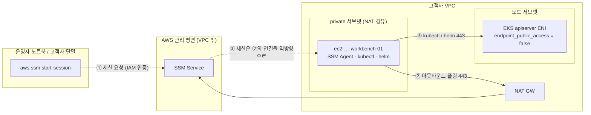

# 40 · Workbench (SSM 기반 도달 지점) 설계

> **흔히 `bastion host`라 부르는 것의 SSM 전용 형태**다. 이름을 바꾼 이유는 §2.0을 읽는다.
>
> **상태**: ✅ **개정 완료 (2026-08-05)** · **개명 (2026-08-06, D-WORKBENCH-RENAME)**.
> [`docs/README.md`](../README.md) 상태표가 인용 가능 여부의 판정 근거다.
>
> **승계 출처**: `terraform-enterprise-poc` `docs/design/40-bastion.md` @ `76285f7`(동결 커밋).
> ⚠️ 그 repo는 동결이므로 **파일명이 구 이름 그대로다** — 개명은 이 repo에만 적용된다.
> 개정 전 이 문서는 **⚠️ 미개정**이었다 — PoC 전제(HCP Terraform 워크스페이스 · `workload=poc` ·
> 인라인 배포 루트 · 실측 리소스 ID)와 실증 서술이 그대로 남아 있었다.
>
> **이번 개정이 바꾼 것**
> 1. **산출물이 배포 루트에서 재사용 모듈로 바뀌었다** — ⛔ `D-BASTION-INLINE` **철회**, `D-WORKBENCH-MODULE` 신설.
> 2. **ArgoCD 종속 서술을 걷어냈다** — 이 문서는 이제 *"private 클러스터에 누가 닿는가"* 만 소유한다(§0).
> 3. **역할 범위를 확정했다** — self-hosted runner 겸용 **안 함**(`D-WORKBENCH-SCOPE`). [`22 §4-2`](22-day2-operations.md)를 닫는다.
> 4. **EKS 접근 3층의 소유를 갈랐다**(`D-WORKBENCH-SEAM`) — 파급으로 `eks-cluster` 계약이 늘어난다(§5).
>
> **실증 기록의 소재**: PoC에서 확인한 값(SSM 등록·tmpfs 고갈·envoy 443 함정·private 전환 V-4~V-9)은
> [`../reference/poc-findings.md`](../reference/poc-findings.md)가 소유한다. **이 repo는 배포하지 않으므로
> 여기에 apply 실증을 적지 않는다** — "동작한다"의 기준은 `tofu test` + 예제 `validate`까지다(§7).

---

## 0. 이 문서가 소유하는 것 / 소유하지 않는 것

| | 내용 |
|---|---|
| **소유** | ① `modules/workbench` 모듈 계약(입력·출력·리소스) ② **private 엔드포인트 클러스터에 대한 도달 지점**의 설계 ③ SSM 기반 접근의 경계와 그 대가 ④ EKS 접근 3층 중 **어느 층을 누가 소유하는가**(§5) |
| **소유하지 않음** | GitOps 부트스트랩 seam(→ [`21`](21-gitops-bootstrap-seam.md) **미결정**) · ArgoCD 토폴로지와 UI 접근 절차(→ 같음) · Day 2 운영 프로파일(→ [`22`](22-day2-operations.md)) · EKS 모듈 계약(→ [`20`](20-eks-module.md)) · 배포 루트 구성(→ [`50`](50-reference-consumer-repo.md)) |

> ⭐ **개정 전 이 문서의 제목은 "ArgoCD private 전환의 선결 과제"였다.** 그 틀을 버린 것이
> 이번 개정의 가장 큰 변화다. 이유는 의존 방향이다 — 40이 ArgoCD를 전제하면 **21(미결정)이 뒤집힐 때
> 40도 함께 흔들린다.** [`01 §3.3`](../architecture/01-module-strategy.md)이 *"관리형 Capability는
> 대안(self-managed ArgoCD 포함)과 함께 다시 결정한다"* 고 적은 이상, 그 재결정은 실제로 뒤집힐 수 있다.
>
> **일반화하면 40은 21과 무관하게 완결된다.** workbench가 푸는 문제는 *"ArgoCD를 어떻게 보나"* 가 아니라
> **"엔드포인트를 닫은 클러스터를 누가 조작하나"** 이고, 이 문제는 21이 무엇으로 결정되든 남는다.
> self-managed ArgoCD를 택해도 helm을 돌릴 지점이 필요하다([`22 §4-1`](22-day2-operations.md)).

---

## 1. 문제 — 엔드포인트를 닫으면 조작 지점이 사라진다

[`20 §3.1`](20-eks-module.md)의 `endpoint_public_access` 기본값은 **`false`** 다. GitOps(pull)를 전제로
한 값이다([`01 §3.1`](../architecture/01-module-strategy.md)). 그런데 private-only 클러스터의 apiserver는
**VPC 내부에서만** 도달한다 — GitHub Actions의 공용 runner도, 운영자 노트북도 닿지 않는다.

**이것이 지금 실제로 비용을 내고 있다.** 소비 repo `iac-reference-infra`의 `live/dev/eks`는
`endpoint_public_access = true`를 켜 두고 다음 주석을 달고 있다.

```
# ⚠️ workbench(design/40)이 아직 없어 private-only 면 kubectl 도달 지점이 없다 — 그래서 public 을 켠다.
```

즉 **모듈의 기본값(private)이 레퍼런스 소비 repo에서 지켜지지 못하는 상태**다. `public_access_cidrs`로
좁혀 두었지만(0.0.0.0/0은 validation이 차단한다) 그것은 완화이지 해소가 아니다.

⭐ **그래서 이 문서 하나만 끝나도 값이 난다** — 위 주석의 이유가 사라지고 소비 repo가 public을 닫을 수 있다.
`21`의 결정을 기다리지 않는다.

### 1.1 도달성 후보 3개와 이 문서의 선택

[`22 §3.4`](22-day2-operations.md)가 세운 후보다.

| 후보 | 성립 방식 | 대가 |
|------|-----------|------|
| **public endpoint + CIDR 제한** | 지금 소비 repo가 쓰는 방식 | 고객사 사무실 IP가 바뀔 때마다 인프라 변경. 재택·VPN·CI runner IP까지 열면 목록이 커진다. **apiserver가 인터넷에 노출된 사실 자체는 남는다** |
| **self-hosted runner** | CI가 VPC 안에서 돈다 | 상시 기동 + runner 등록 자격증명 + 빌드 부하를 견딜 인스턴스. **사람의 조작 지점은 여전히 없다** |
| ⭐ **workbench (SSM)** | VPC 안 조작 지점 | 인스턴스 1대 상시 비용(월 $5 미만). 접근 통제가 **SSM/IAM 한 곳**으로 모인다 |

**workbench를 택한다**(2026-08-04 사용자 결정, [`22 §3.4`](22-day2-operations.md) 상자). 결정적 근거는
비용이 아니라 **경계의 개수**다 — public+CIDR은 "네트워크 경계"와 "IAM 경계"를 둘 다 관리해야 하고,
self-hosted runner는 "CI 자격증명 경계"가 하나 더 는다. SSM은 **인바운드가 아예 없어**
네트워크 경계를 지우고 IAM 하나로 수렴시킨다(§2 D-WORKBENCH-ACCESS).

⚠️ **대신 그 IAM 하나의 무게가 커진다.** SSM 접근 통제가 곧 클러스터 접근 통제가 된다 — §9 열린 항목 1이
그래서 열려 있다.

---

## 2. 결정 요약

### 2.0 ⭐ D-WORKBENCH-RENAME — 왜 `bastion`이 아닌가 (2026-08-06 사용자 결정)

**이름이 실물과 어긋나 있었다.** `bastion host`의 정의적 특성은 **인바운드를 받아 안쪽으로 전달**하는
것(SSH/RDP 점프)인데, 이 모듈은 그 특성을 **하나도 갖지 않는다.**

| 이 모듈의 실물 | bastion 정의와 |
|---|---|
| 인바운드 규칙 **0개** — `main.tf`에 ingress 리소스가 아예 없다 | ⛔ 정반대 |
| private 서브넷 전제, 공인 IP 미할당 | ⛔ 전통적 bastion은 public |
| SSM 세션 전용(22번 없음) — `D-WORKBENCH-ACCESS` | ⛔ |
| `kubectl`·`helm`을 user_data로 설치 | ➕ bastion 정의에 없는 성격 |
| 상태를 담지 않아 수시 생성·파기가 정상 — `D-WORKBENCH-LIFECYCLE` | ➕ 요새가 아니라 소모품 |

즉 이것은 **경계를 지키는 요새가 아니라 도구가 갖춰진 작업대**다. `workbench`가 실물을 가리킨다.

> 🔑 **미학이 아니라 오독 방지다.** "bastion"은 읽는 사람에게 **SSH·22번·public 서브넷**을 연상시킨다.
> 이 모듈은 **인바운드 0이 계약**인데 이름이 그 반대를 암시한다 — 6개월 뒤 다른 사람이
> *"bastion인데 왜 22가 없지"* 로 가는 여지를 **이름이 스스로 만든다.**
>
> ⚠️ **잃는 것**: `bastion`은 업계 표준 용어라 신규 인력·고객사가 즉시 이해한다. 그래서 이 문서와
> 모듈 README 첫 줄에 *"흔히 bastion host라 부르는 것"* 을 명시한다 — 검색·이해 비용을 이름 대신
> 한 줄로 치른다.

**⏱️ 시점이 결정적이었다.** `var.purpose` 기본값이 **식별자**로 흘러간다(태그가 아니라 `name` 인자):
`aws_iam_role.name` · `aws_iam_instance_profile.name` · `aws_security_group.name`(§4.2).

- apply **전**(= 개명 시점)이라 소비 repo plan이 `10 to add, **0 to change, 0 to destroy**` 그대로였다.
- apply **후**였다면 IAM role·instance profile·SG가 **replace**되고, 그 연쇄로 Access Entry
  (principal ARN 변경)와 cluster SG rule(source SG 변경)까지 replace된다.
- ⇒ **소비자 0인 시점에만 공짜다.** `bastion-v0.1.0`은 apply가 0회였으므로
  [`CLAUDE.md`](../../CLAUDE.md)의 *"릴리스된 태그를 덮어쓰지 않는다 — 예외는 소비자가 0일 때뿐"* 에
  정확히 해당한다. 태그는 **삭제하고 `workbench-v0.1.0`을 새로 발행**했다.

#### 구 결정 ID 대응표

2026-08-06 **이전** 커밋·태그·PR 메시지의 `D-BASTION-*`는 이 표로 읽는다.
⛔ **과거 기록은 고치지 않는다** — 커밋 메시지는 그때의 사실이다.

| 구 ID | 신 ID |
|-------|-------|
| `D-BASTION-MODULE` | `D-WORKBENCH-MODULE` |
| `D-BASTION-ACCESS` | `D-WORKBENCH-ACCESS` |
| `D-BASTION-PLACEMENT` | `D-WORKBENCH-PLACEMENT` |
| `D-BASTION-EGRESS` | `D-WORKBENCH-EGRESS` |
| `D-BASTION-LIFECYCLE` | `D-WORKBENCH-LIFECYCLE` |
| `D-BASTION-AMI-PIN` | `D-WORKBENCH-AMI-PIN` |
| `D-BASTION-SCOPE` | `D-WORKBENCH-SCOPE` |
| `D-BASTION-SEAM` | `D-WORKBENCH-SEAM` |

> ⚠️ **`D-BASTION-INLINE` · `D-BASTION-K8S` · `D-BASTION-SUBNET`은 바뀌지 않는다.** 셋 다
> **철회된 PoC repo의 ID**이고 그 repo(`terraform-enterprise-poc`)는 **동결**이라 여전히 구 이름이다.
> 개명하면 그쪽에서 찾을 수 없어져 추적이 끊긴다. 이 문서가 그 셋을 인용할 때는 구 이름을 쓴다.

**개명 범위**: 설계 문서 · 모듈 디렉터리(`modules/workbench`) · 변수(`workbench_enabled`) ·
출력(`workbench_*`) · `purpose` 기본값(`"workbench"`) · 예제. ⛔ `eks-cluster` **계약은 안 바뀐다** —
`cluster_security_group_additional_rules`·`access_entries`는 중립적 이름이라 주석만 갱신했고,
그래서 **`eks-cluster` 태그는 재발행하지 않는다.**

---

승계 결정의 **재판정 결과를 함께 적는다.** "그때 이렇게 정했다"와 "지금도 유효한가"는 다른 질문이고,
미개정 문서를 개정할 때 이 구분을 흐리면 PoC 전제가 조용히 살아남는다.

| ID | 결정 | 승계 상태 | 근거 |
|----|------|-----------|------|
| **D-WORKBENCH-MODULE** | `modules/workbench` **얇은 스크래치 모듈** + `examples/workbench-*` 예제. 소비 repo는 태그로 소싱한다 | 🆕 **신설 — ⛔ `D-BASTION-INLINE` 철회** | 아래 §2.1 |
| **D-WORKBENCH-ACCESS** | **SSM Session Manager 전용** — SSH·키페어·공인 IP·인바운드 SG 규칙 **전부 없음** | ✅ 승계·유효 | SSM Agent가 **아웃바운드로** 연결을 맺고 세션이 그 연결을 역방향으로 흐른다. 인바운드가 원천적으로 불필요하다 → 키 관리·22번 노출·감사 공백이 **동시에** 사라진다. 도구 스택(TFC→OpenTofu)과 무관한 판단이라 그대로 살아 있다 |
| **D-WORKBENCH-PLACEMENT** | **private 서브넷**에 배치. 단 모듈은 **`subnet_id`를 입력받고 서브넷 그룹 이름을 고정하지 않는다** | 🔧 **개정**(구 `D-BASTION-SUBNET`) | 아래 §2.2 |
| **D-WORKBENCH-EGRESS** | 기존 **NAT 경유**. SSM VPCE 3종(`ssm`·`ssmmessages`·`ec2messages`) 미신설 | ✅ 승계·유효(단 §9-2) | 추가 비용 0, 구성 단순. SSM 제어 트래픽은 TLS로 보호되며 AWS 권장 구성 중 하나다. VPCE 3종 × AZ 수는 상시 시간당 요금이라 **NAT가 이미 있는 VPC에서는 중복 지출**이다. ⚠️ NAT 없는 완전 격리 VPC를 요구하는 고객사가 나오면 §9-2로 전환 |
| **D-WORKBENCH-LIFECYCLE** | 상시 기동 **소형 인스턴스**(기본 `t4g.nano`) + **`workbench_enabled` kill switch** | 🔧 **개정** | 상시 기동 자체는 유효하다(인바운드가 없어 공격면 증가가 미미하고 월 $5 미만). **개정 지점은 kill switch** — 재사용 자산에서 "파기하려면 코드를 지운다"는 소비자에게 diff 폭을 강요한다. `vpc_enabled`·`cluster_enabled`와 동형의 토글을 낸다(`01 §4` 재사용 자산 요건) |
| **D-WORKBENCH-AMI-PIN** | AMI ID **명시 핀**. 단 **모듈에 기본값을 두지 않는다**(필수 입력) | 🔧 **개정·강화** | 아래 §2.3 |
| **D-WORKBENCH-SCOPE** | **self-hosted runner로 겸용하지 않는다.** workbench는 사람이 조작하는 지점이다 | 🆕 신설 (2026-08-05 사용자 결정) | 아래 §2.4 — [`22 §4-2`](22-day2-operations.md)를 닫는다 |
| **D-WORKBENCH-SEAM** | EKS 접근 3층 중 **1층(주체 IAM)만 workbench가 소유**하고 **2·3층(Access Entry·SG ingress)은 `eks-cluster`가 소유**한다 | 🆕 신설 (2026-08-05 사용자 결정) | 아래 §5 — ⛔ PoC의 `D-BASTION-K8S`(workbench가 3층 전부 소유) **철회** |

### 2.1 D-WORKBENCH-MODULE — 왜 인라인을 철회하는가

PoC의 `D-BASTION-INLINE`은 *"리소스 5개 미만·분기 없음이므로 배포 루트에 인라인"* 이었다.
그 판단은 **PoC repo 안에서는 옳았다** — 거기엔 배포 루트가 있었고 환경이 하나였다.

**이 repo에는 배포 루트가 없다.** 인라인을 유지하면 이 repo가 소유할 산출물이 **문서뿐**이 되고,
workbench는 고객사마다 복사되는 코드가 된다. 그것은 이 repo의 존재 이유
(*"재사용 자산"*, [`01 §4`](../architecture/01-module-strategy.md))와 정면으로 어긋난다.

- 계층형 하이브리드([`01`](../architecture/01-module-strategy.md))의 **얇은 스크래치 모듈**에 정확히 해당한다 —
  EC2·SG·IAM은 안정적이고 churn이 없어 커뮤니티 모듈을 감쌀 이유가 없다.
- 신규 모듈이므로 **`workbench-v0.1.0`에서 시작**한다(`D-VER-NEW`, [`../architecture/05 §3`](../architecture/05-versioning-policy.md)).
- ⚠️ **"리소스가 적어서 모듈로 감쌀 가치가 없다"는 반론은 이 repo에서 성립하지 않는다.** 모듈의 값은
  리소스 개수가 아니라 **하드닝 규약을 계약으로 고정**하는 데 있다 — IMDSv2 강제·볼륨 암호화·
  인바운드 0·키페어 없음은 인라인으로 복사되면 고객사마다 조용히 빠진다. §4.2가 그 목록이다.

### 2.2 D-WORKBENCH-PLACEMENT — 서브넷 **그룹 이름**을 계약에 넣지 않는다

PoC는 `snet-poc-dev-an2-vm-uniq-a/c`라는 구체 서브넷을 지정했다. 재사용 자산에서는 그럴 수 없다 —
`vm-uniq`는 **PoC VPC의 서브넷 그룹 키**일 뿐이고, [`modules/vpc`](10-vpc-module.md)의 `subnet_groups`는
소비자가 자유롭게 정의하는 map이다(그룹 키가 곧 `Name`의 purpose 토큰이 된다).

- 모듈 입력은 **`subnet_id`(단수)** 다. workbench는 1대이므로 AZ 분산이 의미 없다 — 리스트를 받아
  내부에서 하나를 고르면 "어느 AZ에 떴는지"가 모듈 내부 규칙에 숨는다.
- **private 서브넷일 것**은 계약이 아니라 **문서화된 전제**로 둔다. 모듈이 `data.aws_subnet`으로
  `map_public_ip_on_launch`를 검사해 막을 수는 있으나, **public 서브넷 + 공인 IP 미할당** 조합도
  기술적으로 유효하다. 닫힌 검증은 값이 늘 때마다 부채가 된다(CLAUDE.md 작업 원칙).
- ⭐ **인바운드가 0이므로 public 서브넷은 이득 없이 공격면만 늘린다** — 이 논증은 승계 그대로 유효하다.
  예제는 private 그룹에 배치한다.

### 2.3 D-WORKBENCH-AMI-PIN — 핀은 유지, **기본값은 제거**

`latest` SSM 파라미터(`…/al2023-ami-latest/…`)를 쓰지 않는다는 결정은 유효하다. `latest`는 AWS가
새 AMI를 릴리스할 때마다 값이 바뀌어 **리뷰 없이 인스턴스가 재생성**된다.

**개정 지점은 기본값이다.** PoC는 `ami-0e9f53ecbca0f42fd`를 기본값으로 박았는데, AMI ID는
**리전 종속**이라 재사용 자산의 기본값이 될 수 없다 — 다른 리전 고객사는 apply가 실패하고,
같은 리전이라도 그 AMI는 시간이 지나면 deprecated된다.

> 🔑 **이것은 `D-ADDON-VERSION-PIN-1`([`20 §2.6-6`](20-eks-module.md))과 같은 구조다.**
> *"핀을 쓴다"* 와 *"핀의 값을 모듈이 소유한다"* 는 별개이고, 후자가 재사용을 막는다.
> **모듈은 `most_recent = false`에 해당하는 것(= 명시 인자 요구)만 소유하고, 값은 소비 루트가 소유한다.**

- `ami_id`는 **기본값 없는 필수 입력**이다.
- 값을 찾는 방법은 예제 README가 안내한다(`aws ssm get-parameter --name /aws/service/ami-amazon-linux-latest/...`
  로 **조회해서 그 값을 커밋**한다 — 조회를 코드에 넣지 않는다).
- 업그레이드는 `ami_id`를 bump하는 **명시적 커밋**으로만. plan diff에 인스턴스 재생성이 보이고,
  그것이 의도된 것임을 리뷰가 확인한 뒤 apply한다.

⚠️ **`instance_type`과 `ami_id`의 아키텍처 정합은 모듈이 검증하지 않는다.** arm64 AMI에 x86 타입을
주면 apply에서 죽는다. 검증하려면 AMI를 조회해야 하고(= 핀의 취지와 충돌), 인스턴스 타입 문자열에서
아키텍처를 유도하는 것은 닫힌 열거를 새로 만드는 일이다. **예제와 변수 설명으로 안내한다.**

### 2.4 D-WORKBENCH-SCOPE — self-hosted runner 겸용을 하지 않는다

[`22 §4-2`](22-day2-operations.md)가 *"`40` 개정과 분리해서 결정하지 않는다"* 고 못박은 항목이다.
역할 범위가 인스턴스 타입·SG·IAM을 전부 정하기 때문이다.

**겸용하지 않는다.** workbench는 **사람이 조작하는 지점**이고, 그 결과 다음이 계약이 된다.

| 축 | 겸용 안 함(채택) | 겸용(기각) |
|----|------------------|-----------|
| 인스턴스 타입 | `t4g.nano` 급으로 충분 | 빌드 부하를 견뎌야 함 → 타입 상향 + 비용 |
| IAM | SSM + (선택) `eks:DescribeCluster` | GitHub runner 등록·아티팩트 접근 권한 추가 |
| 자격증명 | **추가 없음** | runner 등록 토큰(회전 대상)이 하나 늘어남 |
| 상시 기동 | 조작할 때만 쓰는 유휴 인스턴스 | CI 대기 시간 때문에 상시가 **요구사항**이 됨 |

**그 대가를 명시한다** — 프로파일 B(helm/kubectl 직접 운영, [`22 §3`](22-day2-operations.md))의 배포는
**사람이 workbench에서 실행**한다. 즉 [`50`](50-reference-consumer-repo.md)의 plan artifact 규약
(*"승인한 계획을 그대로 apply한다"*)에 대응하는 장치가 **helm 경로에는 없다.**

> ⚠️ **이 한계를 숨기지 않는다.** 프로파일 B는 애초에 *"플랫폼 팀이 없는 고객사"* 를 위한 경로이고
> ([`22 §3.1`](22-day2-operations.md)), 그런 조직에 CI 승인 게이트를 강제하면 운영이 멈춘다.
> **작은 조직에 현실적인 절차를 주는 것이 선택의 목적**이지, 구멍을 못 본 것이 아니다.
>
> 🔁 **재검토 조건**: 프로파일 B 고객사가 **환경 3개 이상**(dev/stg/prd)으로 늘어 helm 실행이 반복
> 작업이 되면 그때 다시 판단한다. 그 시점엔 자동화의 값이 자격증명 1개의 대가를 넘어선다.

---

## 3. 도달 경로



**핵심**: ①과 ②는 **별개 방향**이며, workbench으로 들어오는 인바운드 연결은 존재하지 않는다.
③이 성립하는 것은 ②가 이미 열어 둔 연결 위를 세션이 흐르기 때문이다 — 이것이 인바운드 SG 규칙 0개로
셸에 진입할 수 있는 이유다.

④가 성립하려면 **세 층이 모두** 필요하다. 그 소유는 §5가 정한다.

> ⚠️ **PoC가 여기서 한 번 틀렸다** — 앞의 두 층만 갖추고 SG를 빠뜨려 `dial tcp …: i/o timeout`이 났다.
> 🔑 **증상이 인증 오류가 아니라 타임아웃이었다는 것이 단서다** — 인증 계층에 닿지도 못했다는 뜻이다.
> 진단은 **증상의 계층을 먼저 특정하고 그 계층만 의심한다**(원문: [`../reference/poc-findings.md`](../reference/poc-findings.md)).

---

## 4. 모듈 계약 — `modules/workbench`

### 4.1 variables

```hcl
# ── 정체성 (파라미터화 — 01 §4 재사용 자산 요건) ─────────────────────────
variable "naming"  { type = object({ workload = string, env = string, region_code = string }) }
variable "purpose" { type = string, default = "workbench" }
variable "serial"  { type = string, default = "01" }
variable "tags"    { type = map(string), default = {} }

# ── kill switch (D-WORKBENCH-LIFECYCLE) ────────────────────────────────────
variable "workbench_enabled" { type = bool, default = true }

# ── 배치 (D-WORKBENCH-PLACEMENT) ───────────────────────────────────────────
variable "vpc_id"    { type = string }
variable "subnet_id" { type = string }   # private 서브넷 전제(§2.2). 모듈은 검사하지 않는다

# ── 인스턴스 (D-WORKBENCH-AMI-PIN) ─────────────────────────────────────────
variable "ami_id"        { type = string }                      # ⭐ 기본값 없음 = 필수 입력
variable "instance_type" { type = string, default = "t4g.nano" } # ⚠️ ami_id 의 아키텍처와 정합할 것
variable "root_volume_size" { type = number, default = 10 }
variable "root_volume_kms_key_id" { type = string, default = null } # null = AWS 관리형 키

# ── 도구 (user_data) ─────────────────────────────────────────────────────
variable "kubectl_version" { type = string, default = null }  # null = 미설치. 예: "v1.35.7"
variable "helm_version"    { type = string, default = null }  # null = 미설치. 예: "v3.16.4"

# ── EKS 연동 — 1층만 (D-WORKBENCH-SEAM) ────────────────────────────────────
variable "eks_cluster_name" { type = string, default = null }  # null 이면 kubeconfig 생성 안 함
variable "eks_cluster_arn"  { type = string, default = null }  # eks:DescribeCluster 를 이 ARN 으로 한정

# ── egress (D-WORKBENCH-EGRESS) ────────────────────────────────────────────
variable "egress_cidr_blocks" { type = list(string), default = ["0.0.0.0/0"] } # 443/tcp
```

> **교차변수 validation** — `eks_cluster_name`과 `eks_cluster_arn`은 **함께 주거나 함께 비운다.**
> 한쪽만 주면 kubeconfig는 만들어지는데 권한이 없거나(이름만), 권한은 있는데 kubeconfig가 없다(ARN만).
> D-EXTDNS-ZONE([`20 §4.2`](20-eks-module.md))과 같은 형태의 가드를 건다.
>
> ⭐ **거기서 배운 것을 그대로 적용한다**: 가드에 **`&& var.workbench_enabled`를 함께 넣는다.**
> 빠뜨리면 kill switch를 끄는 **파기 경로의 plan이 거부**되어 반쪽 토글이 된다.
> 설계 조건식을 그대로 옮기지 않고 선례를 먼저 찾는 것이 차이를 만들었던 지점이다.

### 4.2 리소스 구성과 하드닝

| 리소스 | `Name` | 비고 |
|--------|--------|------|
| `aws_instance` | `ec2-<w>-<e>-<r>-workbench-01` | 아래 하드닝 4종이 **계약**이다 |
| `aws_security_group` | `sgr-<w>-<e>-<r>-workbench-01` | **ingress 규칙 0개** |
| `aws_vpc_security_group_egress_rule` | `sgr-…-workbench-01-egress-https` | 443/tcp 1건만. SSM·패키지·차트 저장소가 전부 HTTPS다 |
| `aws_iam_role` | `iamr-<w>-<e>-<r>-workbench-01` | 관리형 `AmazonSSMManagedInstanceCore` 1개 |
| `aws_iam_role_policy`(inline) | `iamr-…-workbench-01-eks-policy` | `eks:DescribeCluster` **`eks_cluster_arn` 한정**. `eks_cluster_arn = null`이면 생성 안 함 |
| `aws_iam_instance_profile` | `iamr-…-workbench-01` (role과 **동일명**) | 아래 상자 |
| root EBS 볼륨 | `vol-<w>-<e>-<r>-workbench-01` | gp3, `encrypted = true` |

> **인스턴스 프로파일에 새 약어를 만들지 않는다.** 카탈로그([`../reference/aws-naming-abbreviations.md`](../reference/aws-naming-abbreviations.md))에
> 인스턴스 프로파일 약어는 **없다**. 임의 생성 금지(CLAUDE.md)이므로 남은 선택지는 둘이었다 —
> 물어서 등재하거나, 기존 규약으로 처리하거나.
>
> 🔑 **2026-07-30에 신설된 「종속 객체는 약어를 새로 만들지 않고 부모 이름을 상속한다」 규약이 이미 답이다.**
> 인스턴스 프로파일은 role 없이 존재할 수 없고 콘솔·API에서도 role과 짝으로 다뤄진다.
> IAM에서 role과 instance profile은 **별개 네임스페이스**라 같은 이름이 충돌하지 않는다.
> → **카탈로그 변경 없음.** (PoC도 같은 처리를 했으나, 당시엔 근거가 될 규약이 아직 없었다.)

**하드닝 4종 — 변수로 열지 않는다**(§2.1의 "모듈의 값"):

- `metadata_options`: `http_tokens = "required"`(**IMDSv2 강제**), `http_put_response_hop_limit = 1`
- `root_block_device`: `encrypted = true`, `volume_type = "gp3"`
- `key_name` 미지정 — SSH 키페어를 만들지 않는다(D-WORKBENCH-ACCESS)
- `associate_public_ip_address` 미지정 — private 서브넷 전제(§2.2)

> ⚠️ **hop limit 1은 컨테이너를 workbench에서 돌리면 IMDS가 막힌다는 뜻이다.** workbench는 도구를
> 호스트에서 직접 실행하는 지점이므로 지금 요구에는 맞다. docker/nerdctl로 무언가를 돌리는 요구가
> 실제로 생기면 그때 변수를 연다 — **추측으로 미리 열지 않는다**(CLAUDE.md 작업 원칙).

### 4.3 user_data

`kubectl`·`helm` 바이너리를 **명시 핀 버전**으로 설치하고, `eks_cluster_name`이 있으면 kubeconfig를
시스템 전역(`/etc/kubernetes/kubeconfig` + `/etc/profile.d`)에 생성한다.

> **⚠️ 다운로드 경로는 `/tmp`가 아니라 `/var/tmp`다 — 승계된 함정 중 가장 값진 것**
>
> PoC에서 `t4g.nano`(RAM 512MB)의 **tmpfs가 210MB**라 바이너리 두 개를 연속으로 받다가
> `curl: (23) Failure writing output to destination`으로 죽었다. HTTP는 전부 200이었다.
> 🔑 **"먼저 받은 것이 공간을 먹는 순서 의존"** 이라 수동 재시도도 실패한다.
> → `/var/tmp`(루트 EBS)로 받고 `install` 직후 원본을 삭제한다.
>
> 이 함정은 **`instance_type` 기본값이 작은 한 계속 유효**하다. 실측 원문은
> [`../reference/poc-findings.md`](../reference/poc-findings.md).

- `curl --retry-all-errors`를 유지한다. tmpfs 문제의 해법은 아니지만 부팅 초기 일시적 네트워크 실패를
  흡수한다(`curl --retry`는 연결 실패만 재시도하고 HTTP 오류·DNS 실패는 재시도하지 않는다).
- `aws eks update-kubeconfig`는 **재시도로 감싼다.** IAM 인라인 정책 생성 직후 인스턴스가 부팅하면
  전파 지연으로 권한 오류가 날 수 있다. **Terraform에 `time_sleep`을 넣기보다 부팅 스크립트가 스스로
  견디는 편**이 재생성마다 반복되는 이 상황에 맞다.

### 4.4 outputs

| 출력 | 설명 |
|------|------|
| `workbench_instance_id` | `aws ssm start-session --target <id>`에 그대로 사용 |
| `workbench_security_group_id` | ⭐ **`eks-cluster`의 SG 규칙 소스로 넘긴다**(§5) |
| `workbench_iam_role_arn` | ⭐ **`eks-cluster`의 Access Entry principal로 넘긴다**(§5) |
| `workbench_private_ip` | 도달성 진단용 |

> `workbench_enabled = false`면 위 출력은 전부 `null`이다 — `eks-cluster` 쪽 조립이
> `try()`/조건식 없이 깨지지 않도록 예제가 그 형태를 보여준다.

---

## 5. ⭐ D-WORKBENCH-SEAM — EKS 접근 3층을 누가 소유하는가

workbench가 apiserver에 닿으려면 세 층이 **모두** 성립해야 한다. PoC는 셋을 전부 workbench 컴포넌트가
소유했다(`D-BASTION-K8S`). **이 repo에서는 그렇게 하지 않는다.**

| 층 | 무엇을 결정하나 | 없으면 나타나는 증상 | **소유** |
|----|----------------|---------------------|---------|
| ① IAM `eks:DescribeCluster` | kubeconfig를 **만들 수 있는가** | `update-kubeconfig` 권한 오류 | **`modules/workbench`** |
| ② Access Entry + 정책 | 클러스터 **안에서** 무엇을 하는가 | `401 Unauthorized` | **`modules/eks-cluster`** (`access_entries`) |
| ③ cluster SG ingress 443 | apiserver에 **네트워크로 닿는가** | `dial tcp …: i/o timeout` | **`modules/eks-cluster`** (신설 변수) |

### 5.1 가르는 기준 — 주체냐 대상이냐

**①은 workbench의 권한이고, ②③은 클러스터가 누구를 받아들이는가다.**

- ①은 workbench role에 붙는 인라인 정책이다. 대상 리소스(cluster ARN)를 **참조만** 할 뿐,
  클러스터 쪽에 아무것도 만들지 않는다. → 주체 소유.
- ②③은 클러스터 쪽 리소스다. [`03 §2.3`](../architecture/03-dependencies.md)이 이미 답을 준다:
  > *"cross-SG 참조는 rule 소유권을 쪼개지 말고 (…) 공유 SG에 외부 규칙 기여가 필요하면,
  > **소유 모듈이 허용 소스 목록을 변수로 파라미터화**해 owner가 rule을 생성하게 한다."*

**PoC 방식을 철회하는 실질 이유 3가지**:

1. **의존 방향이 뒤집힌다.** workbench가 Access Entry를 만들면 `workbench → eks-cluster` 의존이 생긴다.
   그런데 실제 생성 순서는 반대다 — 클러스터가 먼저 있고 workbench가 나중에 붙는다.
2. **경쟁 SSOT가 생긴다.** `eks-cluster`는 이미 `access_entries`(type = any) 변수를 노출한다.
   workbench가 두 번째 경로를 만들면 *"이 클러스터의 접근 주체 목록을 어디서 보나"* 의 답이 둘이 된다.
3. **SG rule 소유자가 쪼개진다.** cluster SG의 rule을 두 모듈이 각자 붙이면 drift·충돌이 생긴다
   ([`03 §2.3`](../architecture/03-dependencies.md)).

⚠️ **잃는 것도 있다** — PoC 방식은 *"workbench를 파기하면 접근권도 함께 사라진다"* 는 이점이 있었다.
이 배치에서는 workbench를 지워도 **`eks-cluster` 쪽 Access Entry·SG rule이 남는다**(존재하지 않는 SG를
가리키는 rule은 apply에서 죽고, 존재하지 않는 role의 Access Entry는 조용히 남는다).
→ **예제가 둘을 같은 루트에 두어** `workbench_enabled = false`가 양쪽을 함께 비우는 형태를 보여준다.
이것이 §4.4가 출력을 `null`로 내려 보내는 이유다.

### 5.1-1 ⚠️ 이 배치는 **모듈 간 순환**을 만든다 — 결정적 네이밍이 끊는다

소유를 가르고 나면 참조가 양방향이 된다(2026-08-05 예제 작성 중 발견).

```
workbench.eks_cluster_arn        ← eks-cluster 의 클러스터 ARN
eks-cluster.access_entries     ← workbench 의 role ARN        ⟲ 순환
```

**해법은 [`03 §3.1`](../architecture/03-dependencies.md)의 1순위** — *"결정적 네이밍으로 값 구성"*
(결합도 **없음**). 클러스터 ARN은 이름·리전·계정으로 유도되므로 소비 루트가 **직접 합성**한다.

```hcl
locals {
  cluster_name = "eks-${var.workload}-${var.env}-${var.region_code}-main-01"
  cluster_arn  = "arn:${data.aws_partition.current.partition}:eks:${var.aws_region}:${data.aws_caller_identity.current.account_id}:cluster/${local.cluster_name}"
}
# workbench → local 만 참조 (eks 출력 참조 없음)
# eks     → module.workbench 출력 참조
# ⇒ 단방향. 순환 없음.
```

🔑 **`03`의 조회 우선순위는 "느슨한 결합"만을 위한 것이 아니라 순환 해소 장치이기도 하다** —
SG rule을 별도 리소스로 분리해 순환을 푸는 §2.2와 **같은 역할을 값 층위에서** 한다.
소비 루트는 이미 같은 이유로 `cluster_name`을 local에 두고 VPC·EKS 두 모듈에 넘기고 있었다
([`20 §2.5`](20-eks-module.md)) — 그 패턴을 ARN으로 한 칸 넓힌 것뿐이다.

⛔ **workbench 모듈이 클러스터 이름에서 ARN을 스스로 합성하게 만들지 않는다.** 그러면 모듈이
계정·파티션을 조회해야 하고(`data.aws_caller_identity`·`aws_partition`), 무엇보다 **"이 workbench이
어느 클러스터를 보는가"가 모듈 내부 규칙에 숨는다.** 입력으로 받으면 소비 루트의 코드에 드러난다.

### 5.2 파급 — `eks-cluster` 계약이 늘어난다

②는 기존 `access_entries`로 **이미 가능**하다. **③에는 통과 경로가 없다.**

> 🔑 **또 하나의 "facade가 upstream을 가리는" 사례다.** upstream `terraform-aws-modules/eks` v21에는
> **`security_group_additional_rules`가 처음부터 있다**(`source_security_group_id` 지원 확인).
> upstream이 지원하지 않는 것이 아니라 **우리 wrapper가 넘기지 않고 있을 뿐**이다 —
> `ami_type`(D-NODE-ARCH)과 정확히 같은 형태다. 단정하고 우회를 짰다면
> workbench 모듈이 남의 SG에 rule을 붙이는 부채가 됐을 것이다.

**`20-eks-module.md` 개정에서 정할 것**(이 문서는 요구만 낸다):

- 변수 신설: cluster SG 추가 규칙 통과 (upstream `security_group_additional_rules` → facade 이름은 20이 정한다).
  facade 원칙상 **`cluster_` 접두를 붙여 node SG 쪽과 구분**하는 것을 권한다.
- **릴리스**: `eks-cluster-v0.3.0`. ⛔ `v0.2.0`은 **이미 소비자가 apply까지 마쳐 태그를 옮길 수 없다.**
- ⚠️ **함께 고칠 결함**: `modules/eks-cluster/outputs.tf`의 `cluster_security_group_id` 설명이
  *"EKS가 만든 클러스터 보안 그룹"* 이라고 적혀 있으나, 값은 **upstream 모듈이 만든 SG**다
  (EKS가 자동 생성하는 쪽은 `cluster_primary_security_group_id`이며 우리 모듈은 노출하지 않는다).
  **설명과 값이 다른 SG를 가리킨다** — workbench 규칙을 어디에 붙일지 판단할 때 정확히 오도하는 지점이다.

> ✅ **③이 upstream 경로로 실제 성립하는지 확인했다**: upstream은 `aws_security_group.cluster`를
> `vpc_config.security_group_ids`에 넣으므로 그 SG가 **apiserver ENI에 적용**된다.
> ⚠️ 단 upstream은 이 규칙을 **구형 `aws_security_group_rule`** 로 만든다 —
> [`03 §2.1`](../architecture/03-dependencies.md)이 *"신규 코드에서 미사용"* 이라 판정한 리소스다.
> **우리가 통제할 수 없는 upstream 내부**이므로 규약 위반으로 취급하지 않되, 이 어긋남을 §9-4에 남긴다.

---

## 6. 운영 절차

```bash
# 접속 (인바운드 없음 — IAM 인증만으로 셸에 들어간다)
aws ssm start-session --target <workbench_instance_id> --region <region>

# 클러스터 조작 (kubeconfig 는 user_data 가 전역에 생성)
kubectl get nodes
helm upgrade --install <release> <chart> -n <ns>
```

**로컬 포트포워딩**(VPC 안 엔드포인트를 노트북 브라우저로 보는 경우):

```bash
aws ssm start-session --target <id> --region <region> \
  --document-name AWS-StartPortForwardingSessionToRemoteHost \
  --parameters host="<대상 호스트>",portNumber="443",localPortNumber="<로컬 포트>"
```

> ⚠️ **대상 서비스가 Host 헤더로 라우팅하면 로컬 포트를 443으로 맞춰야 한다.** PoC에서 `8443`으로
> 터널을 열었을 때 TLS는 통과하는데 HTTP만 404였다 — 브라우저가 비표준 포트를 **항상 Host에 포함**하기
> 때문이다(`sudo` 필요). 구체 사례와 실측은 [`../reference/poc-findings.md`](../reference/poc-findings.md).
> **어떤 서비스를 어떻게 노출할지는 이 문서 소관이 아니다**(§0).

---

## 7. 검증 계획

⛔ **이 repo는 배포하지 않는다.** 따라서 `apply` 판정(SSM 등록·세션 접속·`kubectl get nodes`)은
**소비 repo 몫**이다 — 그 경계를 넘어 "검증했다"고 쓰지 않는다(CLAUDE.md 작업 원칙).

### 7.1 이 repo에서 판정하는 것 — `tofu test`(plan 단계)

| ID | 검증 | 통과 기준 |
|----|------|-----------|
| T-1 | 기본 생성 | 인스턴스·SG·IAM role·instance profile이 계획됨 |
| T-2 | **`Name` 태그 규약** | `ec2-`·`sgr-`·`iamr-`·`vol-` 접두 + `naming` 3요소 조합 일치(CLAUDE.md 강제 5) |
| T-3 | **kill switch** | `workbench_enabled = false` → 리소스 0개, 출력 전부 `null` |
| T-4 | **인바운드 0** | ingress rule 리소스가 계획에 **없을 것** |
| T-5 | **하드닝 — 검증 가능한 2종** | `http_tokens = "required"` · hop limit 1 · `encrypted = true` · `gp3` |
| T-6 | EKS 연동 **양성** | `eks_cluster_name` + `eks_cluster_arn` 지정 시 인라인 정책이 **그 ARN으로 한정**되어 계획됨 |
| T-7 | EKS 연동 **음성** ×2 | 한쪽만 지정 → **plan 거부**(§4.1 가드) |
| T-8 | 음성 — kill switch × 가드 | `workbench_enabled = false` + 한쪽만 지정 → **거부되지 않을 것**(파기 경로 보호) |

> ⭐ **T-8이 D-EXTDNS-ZONE에서 배운 것의 회수 지점이다.** 가드에 `&& var.workbench_enabled`를 넣지 않으면
> 이 케이스가 실패하고, 그것이 곧 **파기 불가능한 kill switch**를 뜻한다.

> 🔴 **하드닝 4종 중 2종은 plan 테스트로 지킬 수 없다**(2026-08-05 구현 중 실측).
> `key_name` 미지정·`associate_public_ip_address` 미지정은 **인자를 선언하지 않는 것** 자체가
> 계약인데, 둘 다 optional + computed 라 `mock_provider`가 임의 값을 채운다
> (실측: `key_name = "Wb0Vk"`). 실제 apply에서는 `null`이지만 plan 모킹에서는 볼 수 없다.
>
> ⛔ `mock_resource`로 `null`을 강제해 통과시키지 않았다 — 그러면 assertion이 모듈이 아니라
> **자기 자신의 모킹 설정**을 검증하게 된다. 통과하는 가짜 테스트는 없는 것보다 나쁘다.
>
> 🔑 **일반화: "미지정"을 계약으로 삼는 항목은 plan 테스트로 지킬 수 없다.** 이 둘의 회귀 방지는
> 코드 리뷰와 §4.2의 하드닝 목록에 남는다. 공인 IP는 추가로 서브넷의 `map_public_ip_on_launch`에도
> 달려 있어 **모듈 단독 판정이 애초에 불가능**하다 — 소비 repo의 apply 판정 몫이다(§7.3).

### 7.2 예제 — **기존 `examples/eks-cluster-enterprise`에 넣는다**(신규 예제를 만들지 않는다)

⚠️ 최초 계획은 `examples/workbench-enterprise` 신설이었다. **2026-08-05 구현 중 철회했다.**

- **그 예제는 기존 eks 예제와 90% 중복**이 된다(VPC + EKS 전체를 다시 써야 §5의 3층을 보일 수 있다).
  둘이 갈리면 drift이고, 이 repo는 **예제를 늘리지 않는 문화**다 — PR #9에서 minimal 예제 2종을
  실제로 폐기했다.
- ⭐ **결정적 이유**: `examples/eks-cluster-enterprise`는 이미 `endpoint_public_access = false`이면서
  *"private 클러스터의 kubectl은 VPC 내부(workbench·VPN·DX)에서만 도달한다. 조작 지점을 먼저
  설계하지 않으면 apply 후 클러스터를 만질 수 없다"* 는 주석을 달고 있다.
  **그 예제 자체가 조작 지점이 없는 상태**였다 — workbench를 넣는 것이 그 미해결을 닫는다.

CI 게이트 ⑤(`init -lockfile=readonly` + `validate`)가 검증한다. 이 예제는 `cluster_security_group_
additional_rules`(§5.2)의 **유일한 회귀 방지 장치**이기도 하다 — facade 모듈의 `tofu test`는
upstream에 넘어간 값을 볼 수 없다.

### 7.3 소비 repo가 판정할 것 (이 repo 밖)

`aws ssm describe-instance-information`의 `PingStatus: Online` → 세션 접속 → `kubectl get nodes` →
**`endpoint_public_access = false`로 되돌리고 재확인**. 마지막 단계가 이 설계의 목적이다(§1).

#### ✅ 7.3-1 첫 apply 판정 — `workbench-v0.1.0` (2026-08-06, `iac-reference-infra`)

⛔ **이 절은 이 repo가 apply했다는 뜻이 아니다.** 판정 주체는 소비 repo
(`iac-reference-infra` `live/dev/eks`, apply run
[`31059712680`](https://github.com/skax-ca/iac-reference-infra/actions/runs/31059712680) —
`Apply complete! Resources: 10 added, 0 changed, 0 destroyed.`)이고, 이 문서는 **그 결과를
계약 항목별로 받아 적는다.** "동작한다"의 기준이 `tofu test` + 예제 `validate`라는 것은 그대로다.

**⭐ §5.1이 *"`tofu test`로 지킬 수 없다"* 고 적은 항목이 여기서 처음 실증됐다.**
"미지정 자체가 계약"인 항목은 plan에서 `(known after apply)`라 assertion을 걸 수 없었다 —
mock으로 강제하면 assertion이 자기 모킹 설정을 검증하게 된다.

| 계약 | `tofu test` | 실물(2026-08-06 `describe-instances`·`describe-security-groups`) |
|------|-------------|--------------------------------------------------------------|
| **공인 IP 미할당** | ⛔ 불가(optional+computed) | ✅ `PublicIpAddress: null` |
| **키페어 미지정** | ⛔ 불가(mock이 임의 값을 채움) | ✅ `KeyName: null` |
| **인바운드 0개** | △ 리소스 부재로만 간접 확인 | ✅ `length(IpPermissions) == 0` |
| egress 443/tcp 하나 | ✅ | ✅ `0.0.0.0/0:443` 단일 |
| `ami_id`↔`instance_type` 아키텍처 정합 | ⛔ 불가(§2.3) | ✅ `t4g.nano` + AL2023 arm64 부팅 성공 |

**도달 3층 전부 성립**(§5의 목적):

```
SSM 등록      PingStatus: Online · agent 3.3.4851.0 · AL2023   ← 인바운드 0인 호스트에 제어 평면이 붙었다
cloud-init    status: done                                     ← user_data 완료(비동기라 먼저 본다)
1층           /etc/kubernetes/kubeconfig 생성됨(2447B)         ← eks:DescribeCluster 성립
kubectl       Client Version: v1.35.7                          ← 클러스터 1.35와 마이너 일치
2·3층         kubectl get nodes → 노드 2개 Ready                ← 401도 timeout도 아니다
```

🔑 **`kubectl get nodes`가 반환된 것 자체가 3층 전부의 증거다.** 실패했다면 층별로 **다른 에러**가
났을 것이다 — 1층 없음 → kubeconfig 미생성 / 2층 없음 → `401 Unauthorized` / 3층 없음 →
`i/o timeout`. 층을 특정하는 이 표는 소비 repo `live/dev/eks/README.md §4`가 소유한다.

> ⚠️ **판정 방식**: 대화형 `start-session`이 아니라 `ssm send-command`(AWS-RunShellScript)로
> 실행했다(자동화 환경에 TTY가 없다). **같은 SSM 채널·같은 인스턴스 IAM role·같은 SG**를 지나므로
> 도달성 판정으로는 동등하다. 사람이 붙을 때는 `aws ssm start-session --target <id>`.

> ⏳ **아직 남은 판정**: `endpoint_public_access = false`로 닫고 **재확인**하는 단계.
> 그것이 §1이 말한 이 설계의 목적이고, 위 실증은 그 **선행 조건**일 뿐이다.
> 🔴 순서를 뒤집지 않는다 — 먼저 닫으면 workbench가 안 될 때 클러스터에 닿을 방법이 없다.

---

## 8. 구현 계획

> ⛔ CLAUDE.md 순서: **설계(이 문서) → 검토/승인 → 구현 → 검증**. 아래는 승인 후 착수한다.
> ⚠️ 커밋 단위는 *"변수가 전부 소비되는 시점"* 이다 — tflint `terraform_unused_declarations`가
> 선언만 되고 쓰이지 않은 변수를 exit 2로 잡는다.

| # | 태스크 | 게이트 |
|---|--------|--------|
| 40.1 | `modules/workbench/` 본체 — `versions.tf`·`variables.tf`(교차변수 가드 포함)·`main.tf`·`outputs.tf` | `fmt`·`validate`·`tflint`·`trivy` |
| 40.2 | `user_data` 템플릿(`/var/tmp` 경로 · kubeconfig 재시도) | 위와 동일 |
| 40.3 | `modules/workbench/tests/plan.tftest.hcl` — T-1 ~ T-8 | `tofu test` 통과 |
| 40.4 | **`eks-cluster` 계약 확장**(§5.2) — cluster SG 추가 규칙 통과 변수 + outputs 설명 정정 + 테스트 | `tofu test`(기존 20개 + 신규) |
| 40.5 | `examples/workbench-enterprise` — VPC+EKS+workbench 3층 조립 + README(AMI ID 조회법·소싱 태그 확인법) | 예제 `validate` |
| 40.6 | 릴리스 — **`workbench-v0.1.0`** + **`eks-cluster-v0.3.0`** | CI 6/6 + 로그 본문 확인 |

> 🔁 **릴리스 때마다 할 일**: 예제의 소싱 태그(`?ref=`)를 갱신한다. 2026-08-03에 실제로 놓쳤던 항목이다.
> 40.5 README에 `git tag -l 'workbench-v*'` 확인 장치를 둔다(eks 예제에 이번에 보완한 것과 같은 형태).

> ⚠️ **분리해야 할 축은 PR이 아니라 릴리스다** — 이 문단은 2026-08-05 구현 중 정정됐다.
>
> 최초 서술은 *"40.4를 별도 PR로 분리한다"* 였다. 근거는 `eks-cluster`가 **이미 apply된 소비자가
> 있는 모듈**이라 workbench의 미완성 상태와 릴리스 주기를 묶으면 소비 repo가 workbench를 안 쓰면서도
> `v0.3.0` 대기에 걸린다는 것이었다 — 그 걱정 자체는 유효하다.
>
> 🔑 **그런데 40.5(예제)가 40.4를 선행 의존한다.** 예제는 §5의 3층 배선을 보여야 의미가 있고,
> 3층은 `eks-cluster`의 새 변수를 쓴다. PR을 쪼개면 **예제가 반쪽이 되는 새 문제**가 생긴다.
>
> ⇒ **한 PR로 가되 태그를 따로 단다**(`workbench-v0.1.0` · `eks-cluster-v0.3.0`). 컴포넌트별 cadence
> 분리는 태그가 소유하는 것이지 PR이 소유하는 것이 아니다
> ([`../architecture/05 §4`](../architecture/05-versioning-policy.md)) — 소비 repo는 각자 필요한
> 태그만 올리면 되고, 한쪽을 올리지 않는 선택이 그대로 성립한다.

---

## 9. 비용

| 항목 | 월 추정 (ap-northeast-2 기준, 상시) |
|------|------------------------------------|
| `t4g.nano` on-demand | 약 $3.8 |
| gp3 10GB | 약 $0.9 |
| NAT 데이터 처리 | 미미 (제어 트래픽 위주) |
| **합계** | **약 $5 미만** |

SSM Session Manager 자체는 추가 요금이 없다. ⚠️ 리전·환경 수에 따라 달라지며 **견적이 아니라 규모감**이다.

---

## 10. 열린 항목

1. 🔴 **SSM 세션 로깅** — 세션 기록을 CloudWatch Logs 또는 S3로 남기는 구성이 없다.
   ⚠️ **D-WORKBENCH-SEAM이 이 항목의 중요도를 낮추지 않는다.** 소유는 갈렸어도 workbench role에 부여되는
   Access Entry 정책이 사실상 클러스터 관리 권한이면 **SSM 접근 통제가 곧 클러스터 보안**이다.
   → 고객사 인도 전에 결정한다. 로깅 구성을 모듈이 소유할지(변수)·계정 수준 SSM 설정으로 둘지가 논점.
2. **SSM VPCE 3종** — D-WORKBENCH-EGRESS는 NAT 경유를 택했다. **NAT 없는 완전 격리 VPC**를 요구하는
   고객사가 나오면 `ssm`·`ssmmessages`·`ec2messages` Interface Endpoint 신설로 전환한다.
   그 경우 `egress_cidr_blocks`도 VPC CIDR로 좁힐 수 있다.
3. **Access Entry 정책 범위** — §5는 *"누가 소유하나"* 만 정했고 *"어떤 정책을 붙이나"* 는 소비자 몫으로
   뒀다. `AmazonEKSClusterAdminPolicy`(cluster scope)는 편하지만 넓다. 프로파일 B에서 helm이 실제로
   요구하는 최소 권한이 무엇인지는 첫 수행 후 판단한다([`22 §2.4`](22-day2-operations.md)와 같은 성격).
4. **upstream의 구형 SG rule 리소스** — §5.2 상자. `03 §2.1`이 금지한 `aws_security_group_rule`을
   upstream이 쓴다. 지금은 우리 코드가 아니므로 수용하되, upstream이 신형으로 옮기면 그때 재확인한다.
   ⚠️ **같은 SG에 우리가 신형 rule을 직접 붙이지 않는다** — 소유자를 쪼개는 일이고(§5.1),
   혼용의 실제 위험은 여기서 발생한다.
5. **다중 workbench / 다중 환경** — 모듈은 1대를 전제한다(`subnet_id` 단수). dev/stg/prd에 각각 두면
   자연히 3대가 되므로 지금 요구에는 맞다. **AZ 이중화가 실제 요구로 나오면** 그때 계약을 연다 —
   SSM 접속은 인스턴스 ID를 지정하므로 이중화의 값은 "가용성"이 아니라 "AZ 장애 시 대체 진입"이다.
6. **Windows/기타 OS 도구 세트** — user_data는 AL2023 + arm64/x86 리눅스를 전제한다. 다른 OS 요구가
   생기면 user_data를 변수로 여는 것이 아니라 **별도 모듈**을 검토한다(분기가 계약을 흐린다).
