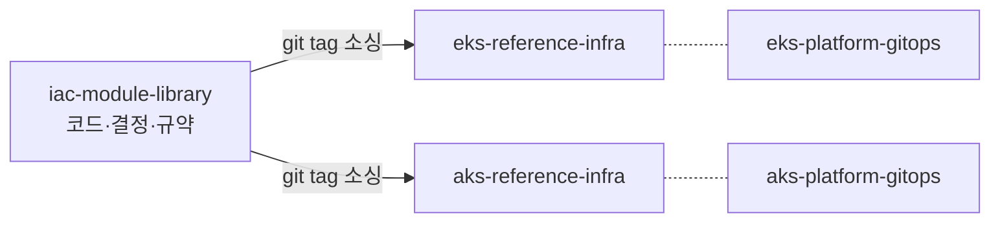
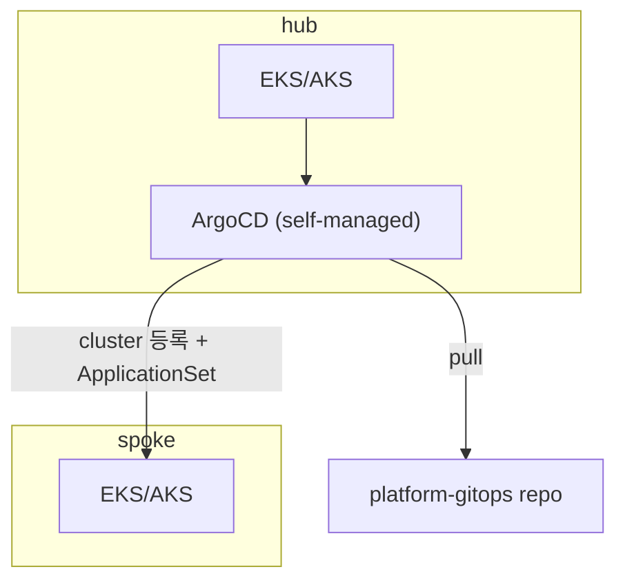
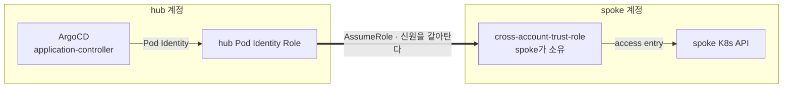
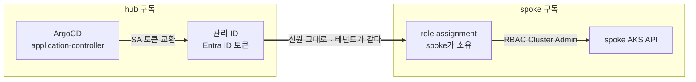
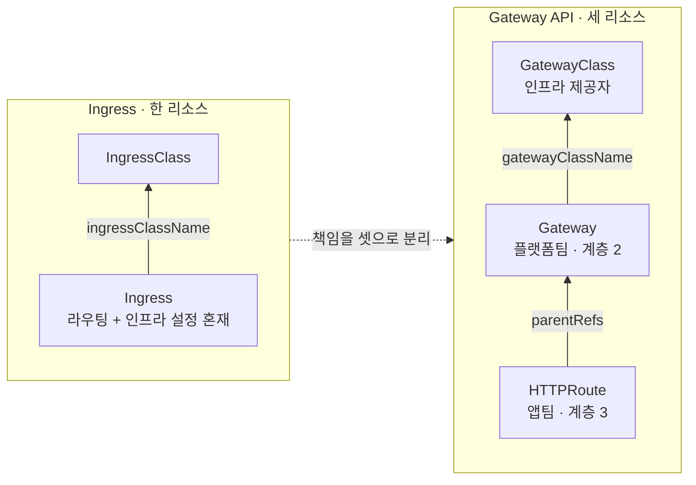

# iac-module-library, 팀의 IaC Asset

## Part 1 · 자산

### 1.1. 매번 다시 하던 고민들

프로젝트마다 아키텍처는 새로 그린다. 그때 풀어낸 결과물을 자산으로 관리하지 않아서,
유사한 구조를 설계하거나 같은 문제에 부딪힐 때 비슷한 고민을 처음부터 다시 한다.
서브넷을 어떻게 쪼갤지, 권한 경계를 어디에 둘지, 이름을 어떻게 붙일지가 매번 같은
질문인데 매번 새로 답한다.

그래서 자산이 필요하다. 우리 팀 미션 중 하나가 여러 프로젝트의 클라우드 구조를 설계하는
일이고, 그 일이 계속되는 한 남겨야 할 자산은 IaC다. 판단이 코드와 문서로 남지 않으면
팀의 역량이 개인의 경험으로만 쌓인다. 코드·결정·규약으로 남겨야 다음 프로젝트가 그 위에서
시작한다. 고민이 남지 않으면 판단의 품질이 매번 사람에 따라 달라진다. 자산화의 목적은
일관성이다.

Part 1은 그 자산이 무엇인지다. Part 2는 그 자산으로 처음 짠 아키텍처 패턴인 GitOps 허브-스포크
구조다. AWS 프로젝트에서 시작했지만 Azure를 쓰는 프로젝트도 이어졌다. AWS에서 정한 패턴을
Azure로 옮기면서 무엇이 그대로 옮겨졌고 무엇을 바꿔야 했는지가 Part 3의 주제다. Part 4는 두
클라우드가 함께 겪는 Ingress에서 Gateway API로의 전환을 다룬다.

---

### 1.2. 코드와 결정

모듈 코드도 아키텍처 패턴도 이 repo에 쓴다. 이 repo가 SSOT이고, 나머지 네 repo는 그
패턴을 실제로 적용한 예시다.

자산은 코드·결정·규약 세 가지다. 이 절에서 앞의 둘을 보고, 규약은 1.4에서 다룬다.



오른쪽 네 저장소가 그 적용 예시다. 점선으로 이은 GitOps 저장소가 어떻게 도는지는 Part 2에서 다룬다.

**코드**
- `modules/aws/*`, `modules/azure/*`.
- 경로 규칙은 `modules/<provider>/<name>/`다.
- 소싱은 태그로 고정한다. `ref=main`은 금지다. 오늘 가져온 코드와 내일 가져온 코드가
  달라지면 안 된다.

**결정**
반복되는 설계 판단과 합의도 문서화해서 자산에 넣는다.
- output 공유 대신 Name 태그로 리소스를 찾는다. 워크스페이스를 분리해도 값을 주고받을 수 있다.
- Security Group rule은 개별 리소스로 뗀다. inline으로 몰아넣으면 순환 의존성과 전체 교체가 생긴다.
- 계정 간 순환 의존성은 Terraform 밖으로 뺀다. TGW RAM 공유 수락을 CI 단계로 옮긴 사례가 그렇다.
- 리소스를 추가할 때 네이밍 컨벤션과 약어 카탈로그도 함께 정의한다.

---

### 1.3. 지금까지 만든 것

| 모듈 | provider | 최신 태그 |
|---|---|---|
| vpc | AWS | v0.5.0 |
| eks-cluster | AWS | v0.11.0 |
| workbench | AWS | v0.9.0 |
| cross-account-trust-role | AWS | v0.4.0 |
| vnet | Azure | v0.2.0 |
| aks-cluster | Azure | v0.9.0 |
| aks-workbench | Azure | v0.7.0 |

버전이 제각각인 것은 모듈마다 성숙 속도가 다르다는 정보다. 태그가 고정이라 소비 측은
흔들리지 않는다.

소싱은 이렇게 한다. `vX.Y.Z`는 자리표시자이고, 실제 최신 태그는 `git tag -l`로 확인한다.

```hcl
module "vpc" {
  source = "git::https://github.com/<org>/iac-module-library.git//modules/aws/vpc?ref=vpc-vX.Y.Z"
  # ...
}
```

---

### 1.4. 일관성을 지키는 장치

- `tofu`만 쓴다. `terraform`과 섞으면 lock 파일이 꼬인다.
- `.tf`를 쓰기 전에 설계 문서 승인부터 받는다. 나중에 왜 이렇게 만들었는지 추적할 수 있어야 한다.
- 리소스 약어는 카탈로그에 등재된 것만 쓴다. 이름만 보고 어느 프로젝트 것인지 알아야 한다.
- 릴리스 태그는 바꾸지 않는다. 고객사가 참조 중인 버전 내용이 몰래 바뀌는 사고를 막기 위해서다.
- 버전은 컴포넌트별 semver로 매기고, 전 모듈이 `0.y.z` 단계다. 모듈마다 성숙 속도가
  다르다.
- 사람이 만들든 Claude Code에 위임해 만들든 이 규약은 똑같이 적용한다. 규칙이 문서로 있어야
  AI도 같은 기준으로 판단한다.

---

### 1.5. 운영 도구와 승인 게이트

OpenTofu·GitHub Actions·S3(Azure는 Blob) backend, 이 조합으로 CI/CD를 짰다. AWS와 Azure가
같은 CI 패턴을 쓴다.

- OpenTofu: 로컬·CI 모두 `tofu` 하나다.
- GitHub Actions: OIDC로 인증한다. 자격증명을 저장소에 심지 않는다.
- S3 / Blob backend: state를 저장하고, lock은 backend 기능으로 건다.

repo는 GitHub organization(`skax-ca`, 무료 플랜) 하나에 모은다. org와 repo 사이에 묶는
계층이 GitHub에 없어서, 관련 저장소는 GitHub Team(`iac`)에 붙여 권한을 한 번에 준다.

CI 게이트는 세 단계다. push는 plan까지만 자동으로 돌고, 사람이 plan 결과를 확인한 뒤,
apply는 `workflow_dispatch` 전용으로 실행한다. 무료 플랜의 private repo는 environment에
required reviewer를 못 걸기 때문에, dispatch 버튼을 누르는 행위 자체가 승인 게이트를
대신한다. 무료 플랜의 제약에 맞춰 게이트를 설계한 것이고, 이 판단도 자산에 문서로 남겼다.

---

## Part 2 · 아키텍처 패턴

### 2.1. 문제: addon을 클러스터마다 따로 관리하게 된다

addon은 클러스터에 공통으로 설치하는 운영 컴포넌트다. 정책 엔진, 오토스케일러, 인그레스
컨트롤러 같은 것들이다. 클러스터 하나면 addon은 그 자리에서 설치한다. 둘 이상이면
Kyverno 같은 정책 도구를 클러스터마다 따로 설치하게 되고, 정책을 하나 추가하거나 버전을
올릴 때마다 클러스터 수만큼 반복한다.

컨트롤러는 비운영에서 먼저 검증하고 운영으로 올리므로, 그동안 두 쪽 버전이 다른 것이
정상이다. 손으로 관리하면 그 차이가 의도한 승격인지 사고인지 가릴 지점이 없다. 전
클러스터가 같아야 할 Kyverno까지 제각각이 되어도 장애가 나야 알게 된다.

관리 포인트도 늘어난다. 클러스터 4개에 addon 5개면 관리 포인트가 20개이고, 클러스터를
하나 늘릴 때마다 관리할 곳이 addon 수만큼 함께 늘어난다.

hub 하나에 배포 도구를 모으고 spoke는 등록만 하면 이 문제가 풀린다. 버전을 올리는 건
`platform-gitops` 저장소 커밋 한 번이고, 의도한 차이는 그 저장소 파일에 적혀 있다.

---

### 2.2. 허브-스포크 등록과 addon 팬아웃

ArgoCD는 hub 하나에만 self-managed로(관리형 서비스 대신 직접 운영) 두고, spoke
클러스터는 원격으로 등록만 한다.



| 기능 | 하는 일 | 푸는 문제 |
|---|---|---|
| cluster 등록 | hub의 ArgoCD가 다른 클러스터의 API 서버에 접속할 수 있도록 자격증명을 등록한다 | ArgoCD 운영 대수와 클러스터 수를 분리한다 |
| ApplicationSet(cluster generator) | 등록된 클러스터 목록을 기준으로 같은 addon 정의를 자동 복제 배포한다 | 클러스터가 늘어도 addon 정의 파일은 늘지 않는다 |

`eks-platform-gitops`·`aks-platform-gitops`에는 CI 워크플로가 없다. ArgoCD가 클러스터 안에서
직접 Git을 당겨오기(pull) 때문이다. Kyverno 버전을 올리는 일은 `platform-gitops`에 커밋 한
번이고, 대상 클러스터가 자동으로 맞춰진다.

eks-platform-gitops의 baseline ApplicationSet 중 `gateway.yaml`은 라벨의 존재 여부만 본다.

```yaml
generators:
  - clusters:
      selector:
        matchExpressions:
          - key: environment
            operator: Exists   # 라벨 존재 여부만 확인
```

값을 고정하지 않고 존재 여부만 보기 때문에, 클러스터 등록 하나를 추가하는 것 자체가 자동
팬아웃이 된다. selector를 어떻게 쓰느냐로 addon마다 전파 정책 하나를 고른다. 조합하지 않는다.

| 정책 | selector | 버전 | 쓰는 곳 |
|---|---|---|---|
| uniform | `environment` 존재 여부 | 전 클러스터 하나 | 우리가 소유한 CR·정책(공유 Gateway, NodePool, 커스텀 ClusterPolicy). `main` 핀이라 나눌 버전이 없다 |
| staged | `tier` 값별로 ApplicationSet 분리 | 티어마다 하나 | 깨지면 클러스터가 망가지는 것(Karpenter·ALB Controller·Gateway API CRD·Kyverno 엔진). 검증 후 승격한다 |
| opt-in | `addon-<name>` 라벨 값 | 구독 클러스터 하나 | 카탈로그(KEDA). 팀이 필요할 때 켠다 |

staged는 같은 addon 파일 안에 **버전 핀을 가진** ApplicationSet을 티어 수만큼 두고 각각에
버전을 단다. `targetRevision`이 `main`인 블록은 나누지 않는다. 저장소 최신을 따라가는 참조라
두 벌로 쪼개도 값이 항상 같아 승격이 기록되지 않기 때문이다. Karpenter의 NodePool CR이
여기 해당한다.

정책 엔진이 staged인 것이 얼핏 어긋나 보인다. 정책 **내용**은 클러스터 간 차이가 곧 통과
기준의 차이라 uniform이 맞다. 그러나 **엔진**은 admission webhook이라 깨지면 그 클러스터의
모든 배포가 막힌다. 폭발 반경으로는 노드 프로비저너보다 크다. 그래서 엔진과 PSS 정책 차트를
staged로 두고(둘은 같은 번호로만 릴리스되어 짝으로 움직인다), 우리가 직접 만든 커스텀 정책만
uniform으로 남긴다. 판정 단위가 addon이 아니라 ApplicationSet인 이유가 이것이다.

nonprd를 먼저 올려 검증하고, 통과하면 prd를 같은 값으로 올린다. 두 `targetRevision`의
차이가 승격이 어디까지 갔는지를 저장소에 기록한다. 파일에 적힌 차이만 의도한 것이고,
그 밖의 클러스터 간 차이는 사고로 본다. 블록 수는 티어 수를 따라가므로 spoke를 늘려도 addon
파일은 그대로다.

opt-in은 cluster Secret에 붙인 라벨 값을 `matchLabels`로 지정해 그 라벨을 단 클러스터만
골라낸다. AWS의 eks-platform-gitops(addons/catalog/keda.yaml)에서는 KEDA가 `addon-keda:
enabled` 라벨이 붙은 클러스터에만 팬아웃한다. Azure는 KEDA가 완전 관리형이라 이
경로를 타지 않는다.

어느 클러스터가 어떤 버전을 쓰는지 저장소만 보면 알 수 있다. 이 세 정책의 판단 기준과 `tier` 라벨 어휘는 `iac-module-library`의
`docs/architectures/gitops-hub-spoke/gitops.md` 「전파 정책: 누가 받고, 어떤 버전을 받나」가
소유한다.

---

### 2.3. 가드레일: hub에 모은 만큼 실수가 닿는 범위도 커진다

배포 편의를 얻은 만큼 한 번의 실수가 닿는 범위도 커졌다. 클러스터 쪽 손댐은 self-heal이,
저장소 쪽 실수는 AppProject가 막는다.

**self-heal · prune: Git과 다르면 되돌린다**

클러스터에서 직접 고친 값은 다음 sync에서 되돌아간다. 전 addon이 같은 `syncPolicy`를 쓴다.

```yaml
syncPolicy:
  automated:
    prune: true      # Git에서 지운 것은 클러스터에서도 지운다
    selfHeal: true   # 손댄 변경은 되돌린다
```

장애 대응으로 급히 손을 댔더라도 Git을 고쳐야 반영된다.

**AppProject: 저장소 쪽 실수를 막는 층은 여기뿐이다**

argo-cd 차트 기본값이 application controller에 `cluster-admin`을 준다. 컨트롤러 자체는 어느
클러스터에 무엇이든 만들 수 있으므로, Kubernetes RBAC으로는 막을 것이 없다. 저장소에 잘못
들어온 매니페스트를 거르는 층은 AppProject 하나다.

| 필드 | 제한하는 것 |
|---|---|
| `sourceRepos` | 어느 차트·매니페스트 저장소에서 받는가 |
| `destinations` | 어느 클러스터·네임스페이스에 배포하는가 |
| `clusterResourceWhitelist` | 어떤 cluster-scoped kind를 만들 수 있는가 |

기본 차단에서 시작해 addon마다 필요한 kind만 연다. addon과 앱 워크로드가 같은 hub를 써도
서로 건드리지 않는 것도 이 층이 보장한다.

---

### 2.4. 3계층과 소유 경계

인프라·플랫폼 GitOps·앱 GitOps, 이렇게 3계층으로 소유를 나눴다. 계층 1과 2는 도구가 달라
저절로 나뉜다. 정작 지키기 어려운 경계는 플랫폼과 앱 사이다.

| 계층 | 무엇을 다루나 | 어디 |
|---|---|---|
| 1. Terraform | 클러스터·관리형 addon·IAM/신원 | `eks`·`aks-reference-infra` |
| 2. 플랫폼 GitOps | helm addon·클러스터 등록·AppProject 가드레일 | `eks`·`aks-platform-gitops` |
| 3. 앱 GitOps | 비즈니스 워크로드 | 앱팀별 repo(이 자산 범위 밖) |

`eks-platform-gitops`·`aks-platform-gitops` 둘 다 `apps/` 디렉토리를 두지 않는다. 관심사를
분리해 플랫폼팀이 소유하는 영역만 담기로 했다. addon 업그레이드는 클러스터 전체에, 앱
배포는 팀 하나에만 영향을 준다. 영향 범위가 다른 것을 같은 저장소에 담지 않는다.

플랫폼과 앱 사이의 경계는 Gateway API에서 리소스 경계와 일치한다. 플랫폼이 Gateway를
소유하고(리스너·포트·TLS), 앱팀은 HTTPRoute를 자기 저장소에 두고 `parentRefs`로 붙인다.
4.2에서 다시 다룬다.

한 계층을 고칠 때 다른 계층을 건드리지 않고, 잘못 올려도 그 계층 밖으로 퍼지지 않는다.

---

## Part 3 · 옮기기

패턴은 AWS에서 먼저 정했다. EKS 허브-스포크 GitOps, Pod 비라우팅 대역, 크로스 계정 신뢰
구조까지 AWS 기준으로 설계를 끝낸 뒤 Azure 프로젝트에 같은 패턴을 적용했다. 결정 하나를
Azure로 옮길 때마다 일어난 일은 셋 중 하나였다.

| 일어난 일 | 뜻 | 사례 |
|---|---|---|
| 그대로 옮겨졌다 | 목표도 방법도 유지했다 | 모듈 인터페이스, 3계층, 권한을 주는 방향 |
| 방법을 바꿨다 | 목표는 두고, 플랫폼이 AWS의 방법을 막았다 | Pod IP 대역, 신원 경계, 가용영역, private L7(Part 4) |
| 답이 달라졌다 | 같은 기준을 적용했는데 두 클라우드의 제공 형태가 달랐다 | 노드 오토프로비저닝, 인그레스, KEDA |

Azure는 처음 다루는 클라우드라 AWS 쪽 방법을 먼저 가져갔다가 막히는 일이 잦았다. 그
시행착오를 3.4에 정리했다.

### 3.1. 그대로 옮겨진 것

원칙은 두 클라우드에서 같은 모양으로 성립했다.

- 모듈 인터페이스 통일, Name 태그 조회, 태그 고정 소싱(Part 1).
- 3계층 소유와 허브-스포크 GitOps(Part 2). ArgoCD는 hub에만 두고 spoke는 등록한다.
- hub는 전부 private으로 둔다.
- 권한은 리소스를 소유한 쪽이 준다. spoke 클러스터에 대한 hub ArgoCD 권한은 spoke 배포
  루트가 만든다.

마지막 원칙은 Azure에 다른 선택지가 있었는데도 유지했다. Azure RBAC은 구독이나 관리 그룹
스코프에 역할을 한 번 할당해 현재와 미래의 클러스터 전부에 적용할 수 있다. Microsoft Learn
공식 문서(Cluster authorization concepts in AKS)는 이를 "한 번 부여해 여러 클러스터를
통제한다"고 표현한다. 그래도 `aks-reference-infra`는 역할 할당 스코프를 클러스터 리소스
하나로 두고, spoke 배포 루트(`live/dev/aks`)에서 만든다. AWS에서 spoke 계정이 신뢰
Role과 access entry를 소유하는 것과 같은 방향이다.

상위 스코프를 쓰지 않은 근거는 Microsoft 문서 두 곳에 있고, 둘이 사슬로 이어진다.

먼저 Azure 랜딩존(Azure Landing Zone) 참조 아키텍처는 hub와 spoke를 서로 다른 관리 그룹에
배치한다. hub는 네트워크 연결 전용 구독(Connectivity, Platform 관리 그룹 아래)에, spoke는
워크로드 구독(application landing zone, Landing zones 관리 그룹 아래)에 들어간다. 구독
스코프로는 둘을 함께 덮을 수 없고, 둘 다 포함하는 스코프를 쓰려면 상위 관리 그룹까지
올라가야 한다.

그런데 CAF 「Management groups」 설계 영역은 관리 그룹 스코프 RBAC 할당을 권고하지 않는다.
권한이 과도해지고 하위 구독까지 상속되기 때문이다. 플랫폼 팀에는 예외를 두지만, 필요한
순간에만 권한을 켜는 방식(PIM)을 전제로 한다. ArgoCD는 워크로드 ID(관리 ID)로
인증하므로 권한을 항상 열어둬야 하고, 그래서 이 예외를 쓸 수 없다. 우리 hub·spoke를
함께 덮는 상위 스코프는 비권고인 관리 그룹뿐이라 쓰지 않았다.

Microsoft 문서와 별개로, 스코프를 넓게 잡으면 그 신원이 탈취됐을 때 영향 범위도 그만큼
넓어진다. 한 번에 부여하는 운영 편의 대신 영향 범위를 좁히는 쪽을 골랐다.

단일 구독에 hub와 spoke를 함께 두는 구성도 가능하다. Azure 아키텍처 센터의 hub-spoke 참조
아키텍처는 단일 리소스 그룹 예제를 제시하고, 구독 분리는 선택지로 설명한다. 이 저장소가
구독을 나눈 것은 Azure 랜딩존 구성을 따랐기 때문이다.

클러스터 스코프를 지키는 대가로 구조를 한 번 바꿨다. hub와 spoke가 서로 다른 구독이라,
hub가 spoke를 조회해 권한을 만들던 방식을 spoke가 hub를 조회하는 방식으로 전환했다
(direction-flip). 전환 후에도 부여는 spoke마다 따로 한다.

| 항목 | AWS(Access Entry) | Azure(Entra ID) |
|---|---|---|
| 플랫폼이 허용하는 부여 단위 | 클러스터 1개 | 클러스터 1개부터 구독·관리 그룹까지 |
| 우리가 쓰는 부여 단위 | 클러스터 1개 | 클러스터 1개 |
| 권한을 만드는 곳 | spoke 배포 루트 | spoke 배포 루트 |
| 커스텀 세분화 | 불가(고정 access policy 중 선택) | 가능(커스텀 role + CRD 단위 조건) |

---

### 3.2. 방법을 바꾼 것

**Pod IP 대역**

IP가 부족한 엔터프라이즈 환경에서 Pod IP를 아끼려 했다. AWS에서는 비라우팅 전용 대역
`100.64.0.0/16`을 모든 VPC가 재사용한다. Pod는 VPC secondary CIDR에 만든 Pod 전용
서브넷에서 IP를 받고(VPC CNI custom networking), VPC 밖으로 나갈 때는 노드 IP로 SNAT된다.
spoke가 늘어도 Pod 대역을 조율할 필요가 없다.

같은 방법을 Azure로 옮겨 `aks-cluster`의 `cni_mode = "pod_subnet"`을 0.1.0 기본값으로
뒀다. 두 곳에서 막혔다.

- 대역이 겹치면 라우팅이 깨진다. hub와 dev에 `100.64.0.0/16`과 `100.65.0.0/16`을 따로
  줘야 했고, 대역을 재사용할 수 없었다.
- AKS가 관리하는 Karpenter인 NAP(Node Auto Provisioning)이 Pod Subnet 모드를 지원하지 않는다
  (karpenter-provider-azure 이슈 #1352, 메인테이너 답변).

그래서 기본값을 `overlay`로 바꿨다. Overlay에서 Pod IP는 VNet 주소 공간 밖에 있고, 노드
밖으로 나가는 트래픽은 노드 IP로 SNAT된다. hub와 spoke가 같은 Pod 대역을 써도 되니 IP를
아끼는 목표도 그대로 지킨다. Microsoft도 plan-pod-networking 가이드에서 Overlay를 일반
기본값으로 권고한다. 대신 NSG 플로우 로그에서 Pod 단위 가시성을 잃는다.
AKS 유료 기능인 Advanced Container Networking Services로 일부 보완할 수 있다(클러스터 단위로
켜고 노드·시간당 과금한다).

| 항목 | AWS(custom networking) | Azure `pod_subnet` | Azure `overlay`(현재 기본) |
|---|---|---|---|
| Pod IP 위치 | VPC secondary CIDR | VNet 서브넷 | VNet 밖(overlay 대역) |
| 클러스터 간 대역 재사용 | 된다 | 안 된다 | 된다 |
| NAP(Karpenter) | 해당 없음 | 지원 안 됨 | 지원 |

**신원 경계**

AWS의 IAM principal은 계정에 속하고, Azure의 principal은 테넌트에 속한다. 이 플랫폼 차이
때문에 계정·구독 경계를 넘는 방법이 달라진다. 목표는 두 클라우드에서 같다. spoke가 연결에
동의하고, 권한도 spoke가 소유한다.

| 목표 | AWS 방법 | Azure 방법 |
|---|---|---|
| spoke가 hub 연결에 동의 | spoke가 RAM 초대를 수락(CI 단계) | spoke 구독이 bootstrap 때 hub CI 신원에 `spoke-peer` 역할을 부여 |
| hub가 spoke 값을 찾음 | 태그로는 다른 계정의 리소스를 조회할 수 없다. RAM이 공유한 ARN과 관리형 접두사 목록으로 찾는다 | 구독이 달라도 태그로 직접 조회한다 |
| hub ArgoCD 인증 | Pod Identity 자격증명으로 spoke 신뢰 Role을 AssumeRole(1단계) | K8s ServiceAccount 토큰을 Entra ID 토큰으로 교환(2단계) |
| spoke 쪽 리소스 | 신뢰 Role(`cross-account-trust-role`) + access entry | role assignment 하나 |

경계를 넘는 지점이 다르다. AWS는 spoke가 만든 Role로 갈아타야 하고, Azure는 같은 신원이
그대로 통해서 spoke가 역할만 준다. 아래 두 그림에서 굵은 화살표가 계정·구독 경계다.





AWS 쪽 방법 중 둘은 AWS가 강제하지 않았다. 배포 계정이 조직 관리 계정이 아니어서 조직 내부
공유를 켤 수 없었고, 그래서 RAM 수락 단계를 CI에 뒀다(`docs/architectures/gitops-hub-spoke/aws/network.md`). spoke 신뢰 Role도 필수는 아니다. EKS access entry는 `STANDARD` 타입이면 다른
계정의 principal도 받는다(AWS EKS 사용 설명서 "Create access entries"). 그래도 "권한은 리소스를
소유한 쪽이 부여한다"는 원칙(3.1)에 따라 신뢰 Role을 spoke에 뒀다. Azure에서는 principal이 테넌트에
속해 spoke의 role assignment 하나로 같은 원칙을 지킬 수 있어서, 대응 모듈을 만들지 않았다.

**가용영역**

두 클라우드 모두 가용영역 이중화가 목표다. 이중화를 거는 계층이 다르다.

| 항목 | AWS(`vpc`) | Azure(`vnet`) |
|---|---|---|
| 서브넷의 AZ 소속 | 속한다 | 속하지 않는다(리전 전체에 걸친다) |
| 이중화하는 곳 | 서브넷: AZ마다 서브넷을 따로 만든다 | 리소스: 리소스를 만들 때 zone을 지정한다 |
| NAT Gateway 배치 | AZ당 1개(가용성 우선 기본값) | VNet당 1개(모듈 선택) |

NAT Gateway 개수는 모듈 설계로 정했다. Azure도 서브넷마다 다른 NAT Gateway를 붙일 수 있지만,
`vnet` 모듈은 VNet당 하나만 만든다.

private L7 인그레스도 방법을 바꾼 사례로, Part 4에서 설명한다.

---

### 3.3. 같은 기준, 다른 답

관리형 기능을 쓸지는 한 기준으로 정했다. **이 저장소의 다른 패턴과 충돌하지 않으면 쓴다.**
요금은 줄어드는 운영·유지보수 부담과 견줘 본다. 유료라도 부담이 줄면 쓰는 편이 나을 수
있다. 충돌하면 Terraform이 IAM 같은 전제를 만들고 GitOps(Helm)가 컨트롤러를
조립한다(`docs/decisions.md` 「관리형 기능 채택 기준」).

AWS에서 관리형 노드 오토프로비저닝은 EKS Auto Mode뿐이고, 패턴 충돌에 걸렸다.

- Auto Mode 내장 로드밸런서 컨트롤러가 Gateway API를 지원하지 않는다(오픈소스 ALB
  Controller는 v3.0.0에서 Gateway API GA, Auto Mode 내장 컨트롤러는 미지원). self-managed ALB
  Controller가 만든 로드밸런서를 Auto Mode 관리로 옮기는 경로도 AWS가 지원하지 않는다.
- Auto Mode 노드에는 VPC CNI의 `ENIConfig` custom networking을 쓸 수 없어, 3.2의 Pod 대역
  배선을 NodeClass 설정으로 다시 설계해야 한다.

EC2 요금에 더해 인스턴스 유형별 관리 수수료도 붙는다(AWS EKS 요금표). 기각은 위 두 제약으로
정했다. 그래서 Karpenter와 ALB Controller를 GitOps로 조립했다.

Auto Mode는 노드 오토스케일링을 포함해 아래 영역을 한 묶음으로 관리한다(AWS EKS 사용 설명서
"Automate cluster infrastructure with EKS Auto Mode"). AKS는 같은 영역을 기능 단위로
제공하니, 패턴과 충돌하지 않는 것만 골라 켤 수 있다.

| 영역 | EKS Auto Mode(묶음) | AKS(기능 단위) |
|---|---|---|
| 노드 오토스케일링 | Karpenter 기반 auto scaling | NAP |
| 로드밸런싱 | Service·Ingress용 ALB/NLB 프로비저닝 | App Routing(Gateway API) |
| 블록 스토리지 | EBS CSI | Disk·File CSI 드라이버 |
| Pod 네트워킹·네트워크 정책 | Pod IP 할당, network policy | Azure CNI Overlay + Cilium |
| 워크로드 신원 | Pod Identity Agent 내장 | 워크로드 ID |

Azure에서는 같은 기준을 통과했다. NAP은 AKS가 Karpenter를 배포·관리하고 overlay와 함께
동작하며, AKS 요금표에 별도 항목도 없다. App Routing과 KEDA add-on도 같다. 컴포넌트별 판정은
`docs/architectures/gitops-hub-spoke/gitops.md` 「관리형으로 받을 것과 조립할 것」에 있다.

두 클라우드는 addon의 라이프사이클도 다르다. NAP·App Routing 같은 AKS 관리형은 AKS가 클러스터
업그레이드에 맞춰 버전을 갱신한다. EKS에서 GitOps로 조립한 addon은 클러스터와 따로 버전을
관리하고, Part 2의 티어별 승격(`staged`)으로 비운영부터 올린다. 관리형을 쓰면 플랫폼 관리자가
addon 버전을 따로 추적·승격하지 않아도 되니 유지보수 부담이 작다.

AKS가 관리형을 더 많이 제공하는 데는 클러스터 구조 차이도 있다. AWS에서는 노드 없는
클러스터로 시작해 관리형 노드그룹·Fargate·Karpenter 중 원하는 조합으로 컴퓨트를 붙인다.
Azure는 클러스터를 만들 때 노드 풀을 최소 하나 자동으로 만들고, 이 노드 풀("System" 모드)에서
coredns 같은 핵심 시스템 파드를 돌린다. AKS는 시스템 컴포넌트를 처음부터 플랫폼 책임으로
두었고, CSI 드라이버와 Cluster Autoscaler도 클러스터 리소스의 필드(`storage_profile`,
`auto_scaling_enabled`)로 켠다.

**Addon 비교**

아래 표의 기호는 세 단계다. ●는 완전 관리형이다(설치와 운영을 플랫폼이나 IaC가 끝낸다). ◐는
Terraform이 IAM 같은 전제를 만들고 컨트롤러 설치·버전 갱신은 GitOps(Helm)가 맡는다. 2.4의
계층 1(Terraform)과 계층 2(GitOps)가 함께 만드는 addon이다. ○는 Terraform 전제 없이 완전
self-hosted다.

| 컴포넌트 | AWS(EKS) | Azure(AKS) |
|---|:---:|:---:|
| 스토리지 CSI(블록+파일) | ● | ● |
| Cluster Autoscaler | ◐ | ● |
| 노드 오토프로비저닝(Karpenter/NAP) | ◐ | ● |
| KEDA | ○ | ● |
| Ingress / Gateway API | ◐ | ● |
| Kyverno | ○ | ○ |

스토리지 CSI는 AWS에서도 관리형이다. EBS·EFS 모두 EKS 관리형 addon으로 IaC가 설치까지
끝낸다(Azure는 필드 하나로 Disk와 File을 함께 켠다).

---

### 3.4. 시행착오를 결정으로 남겼다

AWS 방법을 먼저 가져갔다가 막힌 과정이 `aks-cluster`의 버전 이력에 그대로 있다. 첫 릴리스
후 12일 동안 0.1.0에서 0.9.0까지 올라갔다.

| 버전 | 날짜 | 바꾼 것 | 계기 |
|---|---|---|---|
| 0.1.0 | 08-28 | 첫 릴리스(`pod_subnet` 기본) | AWS custom networking을 그대로 옮김 |
| 0.2.0 | 09-03 | `cni_mode` 3모드 선택형 | NAP이 Pod Subnet을 지원하지 않음 |
| 0.3.0 | 09-03 | 기본값을 `overlay`로 전환 | Microsoft 공식 권고 재검토 |
| 0.4.0 | 09-03 | overlay의 network policy를 cilium으로 | 실제 apply에서 ARM이 거부 |
| 0.5.0 | 09-03 | 노드 풀 `upgrade_settings` 명시 | 실제 apply에서 plan이 수렴하지 않음 |
| 0.6.0~0.9.0 | 09-07~09-09 | KEDA·App Routing·Entra 통합 토글 등 | 소비 저장소 요구 |

0.4.0과 0.5.0은 mock provider 기반 `tofu test`로는 잡을 수 없는 ARM 수준 문제였고, 소비
저장소의 실제 apply에서 드러났다. CNI 모드와 network policy 판단은
`docs/architectures/gitops-hub-spoke/azure/network.md` 「Pod 네트워킹: Overlay」에, 버전마다
바꾼 내용은 각 태그 메시지(`git tag -n`)에 남았다.

다음에 한 클라우드의 패턴을 다른 클라우드로 옮길 때는 결정마다 세 가지를 묻는다.

1. 이 결정의 목표는 무엇인가.
2. 같은 방법이 성립하는가. 플랫폼 공식 문서로 확인한다.
3. 같은 기준을 적용하면 답도 같은가. 패턴 충돌과 제공 형태를 확인한다.

---

## Part 4 · Ingress에서 Gateway API로

### 4.1. 지금 옮기는 이유

- **ingress-nginx 지원 종료(EOL)**: Kubernetes SIG Network와 Security Response Committee가
  2025-11에 지원 종료를 발표했고, 2026-03에 업스트림 지원이 끝났다. 이후 릴리스·버그
  수정·보안 패치가 없다. 기존 배포는 계속 동작한다.
- **AKS 관리형 NGINX 종료**: Azure의 App Routing add-on(NGINX 기반)은 2026-11까지만 중요
  보안 패치를 지원한다. Microsoft는 App Routing의 Gateway API 구현으로 옮기라고 권고한다.
- **AWS**: ALB Controller는 ingress-nginx 위에서 돌지 않아 이 지원 종료의 영향을 직접 받지 않는다.
  Ingress API도 frozen일 뿐 제거 계획이 없어 그대로 써도 된다(Kubernetes 공식 문서). 그래도
  옮기는 이유는 4.3(앱팀 매니페스트 통일)이다. ALB Controller는 2026-03에 Gateway API를 GA로
  지원했다(AWS 공식 블로그). 단, EKS에 ingress-nginx를 자체 설치한 클러스터는 Azure와 같은
  일정으로 옮겨야 한다.
- **Ingress API 자체의 한계**: 라우팅 규칙과 인프라 설정을 리소스 하나에 담고, 세부 동작은
  구현체마다 다른 annotation으로 확장한다. 구현체를 바꾸면 annotation을 다시 써야 한다.

### 4.2. 리소스 셋, 소유자 셋

Ingress는 라우팅 규칙과 인프라 설정을 리소스 하나에 담는다. Gateway API는 같은 책임을 세
리소스로 나눈다. 아래에서 화살표는 참조 방향이다. 아래 리소스가 자기 필드에 위 리소스의
이름을 적어 가리킨다.



이 분리가 Part 2의 3계층과 겹친다.

| 리소스 | 소유자 | 우리 계층 | AWS | Azure |
|---|---|---|---|---|
| GatewayClass | 인프라 제공자 | AWS 계층 2, Azure 계층 1 | `alb`: platform-gitops가 만든다 | `approuting-istio`: AKS가 자동 등록한다 |
| Gateway | 클러스터 운영자 | 계층 2 | `gateway-system/shared-gateway` | `gateway-system/shared-gateway` |
| HTTPRoute | 애플리케이션 개발자 | 계층 3 | 앱팀 저장소 | 앱팀 저장소 |

저장소 권한에 더해 클러스터 안에서도 경계를 건다. Gateway 리스너의
`allowedRoutes.namespaces`를 `from: Selector`로 두고 `shared-gateway/access: "true"` 라벨을
요구한다. 이 라벨을 단 네임스페이스의 HTTPRoute만 Gateway에 붙을 수 있다. 검사는 Gateway
컨트롤러(구현체)가 HTTPRoute를 Gateway에 붙일 때 하고, 거부되면 HTTPRoute의 status에
`Accepted: False`로 남는다.

### 4.3. 앱팀이 쓰는 매니페스트는 같다

AWS와 Azure에서 HTTPRoute는 같은 파일이다. 구현체 차이는 Gateway 쪽에만 있다.
`gatewayClassName`(`alb` 또는 `approuting-istio`)과 internal LB 설정 방법이 다르다.

```yaml
apiVersion: gateway.networking.k8s.io/v1
kind: HTTPRoute
metadata:
  name: orders
  namespace: orders            # shared-gateway/access: "true" 라벨이 붙은 네임스페이스
spec:
  parentRefs:
    - name: shared-gateway
      namespace: gateway-system
  rules:
    - matches:
        - path:
            type: PathPrefix
            value: /orders
      backendRefs:
        - name: orders
          port: 8080
```

앱팀이 `parentRefs`로 가리키는 Gateway는 플랫폼팀 저장소에 있고, 여기에만 구현체 차이가 있다.
이름과 네임스페이스는 양쪽이 같고, `gatewayClassName`과 internal LB를 지정하는 방법이 다르다.

EKS(`eks-platform-gitops`). internal LB는 ALB Controller의 `LoadBalancerConfiguration` CR로
지정하고, Gateway가 `parametersRef`로 그 CR을 가리킨다. CR은 Gateway와 같은 네임스페이스에
있어야 한다.

```yaml
apiVersion: gateway.networking.k8s.io/v1
kind: Gateway
metadata:
  name: shared-gateway            # 양쪽 같음
  namespace: gateway-system
spec:
  gatewayClassName: alb           # 다름
  infrastructure:
    parametersRef:                # 다름: 내부 LB는 별도 CR로
      group: gateway.k8s.aws
      kind: LoadBalancerConfiguration
      name: shared-gateway
  listeners:
    - name: http
      protocol: HTTP
      port: 80
      allowedRoutes:
        namespaces:
          from: Selector
          selector:
            matchLabels:
              shared-gateway/access: "true"
---
apiVersion: gateway.k8s.aws/v1beta1
kind: LoadBalancerConfiguration
metadata:
  name: shared-gateway
  namespace: gateway-system
spec:
  scheme: internal
```

AKS(`aks-platform-gitops`). internal LB는 Gateway API v1의 `infrastructure.annotations`에 AKS
표준 Service annotation을 얹는다. 별도 CR이 없다.

```yaml
apiVersion: gateway.networking.k8s.io/v1
kind: Gateway
metadata:
  name: shared-gateway            # 양쪽 같음
  namespace: gateway-system
spec:
  gatewayClassName: approuting-istio   # 다름: AKS가 자동 등록한 이름
  infrastructure:
    annotations:                       # 다름: 내부 LB는 annotation으로
      service.beta.kubernetes.io/azure-load-balancer-internal: "true"
  listeners:
    - name: http
      protocol: HTTP
      port: 80
      allowedRoutes:
        namespaces:
          from: Selector
          selector:
            matchLabels:
              shared-gateway/access: "true"
```

Ingress에서는 annotation 때문에 구현체마다 매니페스트가 달랐다. Gateway API로 옮기면 앱
저장소의 라우팅 파일이 클라우드와 무관해진다.

### 4.4. 플랫폼팀이 하는 일은 다르다

Part 3의 세 가지가 이 기능 하나에 다 들어 있다.

| 항목 | AWS | Azure | Part 3 분류 |
|---|---|---|---|
| 3계층 소유·`allowedRoutes`·HTTPRoute | 같다 | 같다 | 그대로 옮겨졌다 |
| internal 전용 | `LoadBalancerConfiguration`의 `scheme: internal` | Gateway `spec.infrastructure.annotations`에 internal LB annotation | 방법을 바꿨다 |
| 표준 Gateway API CRD | GitOps가 git 소스로 설치 | AKS가 관리(Managed Gateway API) | 답이 달라졌다 |
| 컨트롤러 | ALB Controller를 Helm으로(GitOps) | istiod를 AKS가 관리, AKS 버전에 맞춰 자동 갱신 | 답이 달라졌다 |
| GatewayClass | 직접 만든다 | AKS가 자동 등록한다 | 답이 달라졌다 |
| Terraform 몫 | ALB Controller IAM(Pod Identity) | 클러스터 `ingressProfile` 활성화 | |

Azure 구현체는 한 번에 정하지 못했다. AWS의 ALB에 대응하는 관리형 서비스부터 찾았고, 그렇게
고른 첫 후보가 막혔다. AWS 방법을 먼저 가져갔다가 플랫폼 제약에 걸려 바꾼, 3.4의 Pod
대역과 같은 시행착오다.

| 후보 | 결과 | 성격 |
|---|---|---|
| Application Gateway for Containers | 먼저 채택했다가 교체. frontend가 private IP를 지원하지 않아 "hub는 전부 private" 원칙과 충돌 | 플랫폼 제약 |
| Cilium Gateway API | AKS의 관리형 Cilium이 Gateway API 기능을 노출하지 않음 | 플랫폼 제약 |
| Envoy Gateway(자체 설치) | 가능했지만 관리형 우선 기준에 따라 보류 | 우리 선택 |
| App Routing Gateway API(Istio 기반) | 채택. 관리형이고 internal LB를 annotation으로 지원. AKS Automatic 1.36 이상 신규 클러스터의 기본값 | |

### 4.5. 실제로 부딪힌 함정

- **ALB Controller의 CRD 감지 캐싱**: ALB Controller는 Gateway API CRD가 있는지를 파드 시작
  시점에만 확인한다. CRD를 나중에 설치하면 컨트롤러를 재시작해야 한다. 재시작하지 않으면
  GatewayClass가 `Accepted=Unknown`에서 오류 없이 멈춘다.
- **Gateway가 곧 과금**: Gateway를 만드는 순간 ALB가 생긴다. HTTPRoute가 없어도 과금된다.
- **`sourceRanges`의 nil과 빈 배열**: 필드를 비워 두면 0.0.0.0/0으로 열리고, 빈 배열
  `[]`을 명시하면 인바운드 규칙이 0개가 된다. 우리는 `[]`로 두고 호출자가 생기면 연다.
- **Azure의 순서 의존**: Terraform이 `ingressProfile`을 켜기 전에 Gateway가 먼저 동기화되면
  `Accepted: False`로 기다린다. 순서가 GitOps 밖(Terraform CI)에 있어 sync-wave로 표현할 수
  없다. selfHeal이 켜져 있어 Terraform apply가 끝나면 풀린다.
- **App Routing Gateway API의 제약**: TLSRoute(SNI passthrough)를 아직 지원하지 않는다.
  자체 설치한 Gateway API CRD와 함께 쓸 수 없고, Managed Gateway API를 켜야 한다.

### 4.6. 팀이 할 일

- 기존 Ingress 매니페스트는 ingress2gateway(1.0, 2026-03 릴리스)로 HTTPRoute 초안을 만든다.
  구현체 annotation으로 쓰던 동작은 변환 결과를 직접 확인한다.
- 앱 네임스페이스에 `shared-gateway/access: "true"` 라벨을 단다.
- HTTPRoute의 `parentRefs`는 `gateway-system/shared-gateway`를 가리킨다.
- AWS에서 접근 CIDR이 필요하면 platform-gitops 저장소의 `sourceRanges`에 추가하는 PR로
  요청한다.

---

## 닫으며

모듈은 계속 늘어나고 AWS·Azure도 계속 달라진다. 판단을 남겼으니 다음 프로젝트는 그 위에서
시작한다. 앞으로 할 일이다.

- EKS·AKS 양쪽에서 nonprd를 먼저 올리고 운영으로 승격하는 경로를 실제로 돌려보고, 거기서
  나온 개선사항을 모듈에 반영한다.
- Claude Code로 이 자산과 그걸 소비하는 배포 repo 넷을 한 세션에서 함께 고치는 방안을 검토한다.
- Private repo → Public 전환을 검토한다. 무료 플랜의 CI 월 2,000분과 기능 제약을 풀고,
  팀원이 바로 볼 수 있게 한다.
- 실제 프로젝트에서 쓴 조합과 판단 근거를 새 아키텍처 패턴으로 자산에 쌓는다.

같은 원칙으로 새 모듈을 얹는다.
