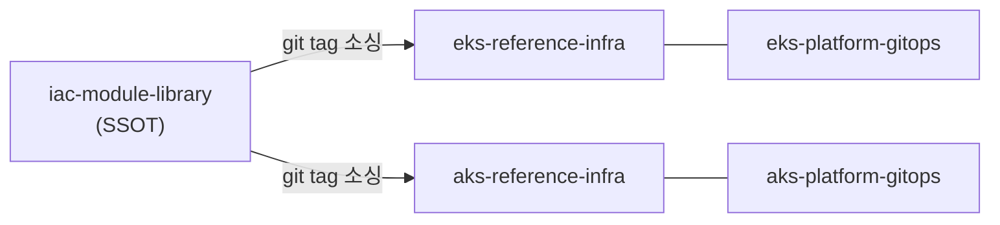
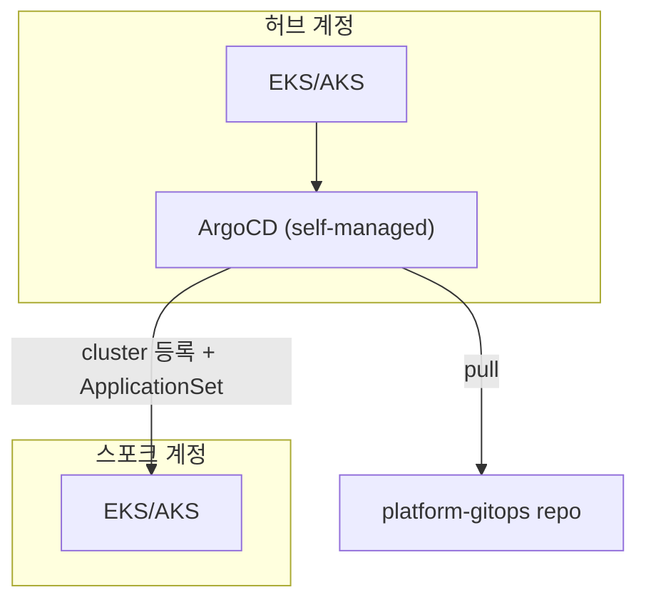

# iac-module-library, 팀의 IaC 자산

초안 v3. 핵심 메시지는 하나다. Terraform 모듈을 GitHub org 레벨에서 자산으로 관리하고, 계속
추가·갱신한다. Claude Code는 이걸 실행하는 도구다.

---

## 1. 왜 자산 라이브러리인가

프로젝트마다 VPC·EKS·IAM을 새로 짜면 재사용이 안 되고, 보안 수준도 프로젝트마다 갈린다.
고객사는 구독 라이선스 없이 바로 착수해야 한다. 그래서 모듈과 아키텍처 패턴을 GitHub org
차원의 자산으로 관리하고, 계속 늘려간다.

---

## 2. 자산: iac-module-library

이 repo가 SSOT다. 나머지 repo는 여기서 모듈을 가져다 쓴다.

**코드**
- `modules/aws/*` 4개, `modules/azure/*` 2개.
- 경로 규칙은 `modules/<provider>/<name>/`다.
- 버전은 컴포넌트별 semver 태그(`vpc-v0.5.0`, `aks-cluster-v0.1.0`...), 전부 `0.y.z` 단계다.
- 소싱은 태그로 고정한다. `ref=main`은 금지다. 오늘 가져온 코드와 내일 가져온 코드가
  달라지면 안 된다.

**패턴**
코드만 자산이 아니다. 반복되는 설계 판단과 합의도 문서화해서 넣는다.
- output 공유 대신 Name 태그로 리소스를 찾는다. 워크스페이스를 분리해도 값을 주고받을 수 있다.
- Security Group rule은 개별 리소스로 뗀다. 콘솔에서 rule을 추가해도 drift로 안 잡힌다.
- 계정 간 순환 의존성은 Terraform 밖으로 뺀다. TGW RAM 공유 수락을 CI 단계로 옮긴 사례가 그렇다.
- provider가 늘 때마다 네이밍 컨벤션과 약어 카탈로그도 함께 정의한다. Azure 진출 때 약어
  13개를 새로 등재했다.

---

## 3. 적용 사례: EKS/AKS GitOps 패턴

`iac-module-library`의 모듈로 무엇을 지을 수 있는지 보여주는 예시다. 이 4개 repo는 자산을
소비한 결과물이다.

| repo | 역할 |
|---|---|
| `eks-reference-infra` | AWS 배포 루트. 이 repo의 모듈을 태그로 소싱 |
| `eks-platform-gitops` | AWS 플랫폼 GitOps 매니페스트 |
| `aks-reference-infra` | Azure 배포 루트. 이 repo의 모듈을 태그로 소싱 |
| `aks-platform-gitops` | Azure 플랫폼 GitOps 매니페스트 (예정) |

구조는 3계층이다. 인프라(Terraform), 플랫폼 GitOps(ArgoCD), 앱 GitOps. ArgoCD는 허브
하나에만 두고 스포크 클러스터는 원격으로 등록만 한다. 클러스터가 늘어도 addon 배포·운영
부담은 곱으로 늘지 않는다.

cluster 등록, ApplicationSet(cluster generator), self-heal, AppProject 네 기능이 addon
반복 배포·drift·경계 문제를 푼다. 자세한 내용은 별도 세션에서 다룬다.

---

## 4. 지금까지 만든 것

| 모듈 | provider | 최신 태그 |
|---|---|---|
| vpc | AWS | v0.5.0 |
| eks-cluster | AWS | v0.11.0 |
| workbench | AWS | v0.9.0 |
| cross-account-trust-role | AWS | v0.4.0 |
| vnet | Azure | v0.2.0 |
| aks-cluster | Azure | v0.1.0 |

최근 나흘 사이 PR 4건을 병합해 Azure 모듈 2개를 새로 냈고, 기존 모듈 계약도 보강했다.
`eks-reference-infra`와 `aks-reference-infra`가 이 태그들을 실제로 소싱해서 배포 중이다.
`aks-reference-infra`는 hub networking과 vWAN을 이미 실배포했다.

---

## 5. 일관성을 지키는 장치

- `tofu`만 쓴다. `terraform`과 섞으면 lock 파일이 꼬인다.
- `.tf`를 쓰기 전에 설계 문서 승인부터 받는다. 나중에 왜 이렇게 만들었는지 추적할 수 있어야 한다.
- 리소스 약어는 카탈로그에 등재된 것만 쓴다. 이름만 보고 어느 프로젝트 것인지 알아야 한다.
- 릴리스 태그는 바꾸지 않는다. 고객사가 참조 중인 버전 내용이 몰래 바뀌는 사고를 막기 위해서다.
- 버전은 컴포넌트별 semver로 매기고, 전 모듈이 `0.y.z` 단계다. 버전이 서로 다른 건 결함이
  아니라 정보다.
- 사람이 만들든 Claude Code에 위임해 만들든 이 규율은 똑같이 적용한다. 규칙이 문서로 있어야
  AI도 같은 기준으로 판단한다.

---

## 6. 다음 할 일

- 다음 Azure 모듈 착수 여부.
- 각 모듈이 `1.0.0`을 찍을 때 CHANGELOG.md 도입을 다시 검토한다.
- `docs/architectures/aks-gitops-hub-spoke`는 AKS 실배포와 크로스 구독 GitOps 인가를
  실측한 뒤 쓴다.

계속 추가하고 갱신하는 게 이 자산의 존재 이유다.
